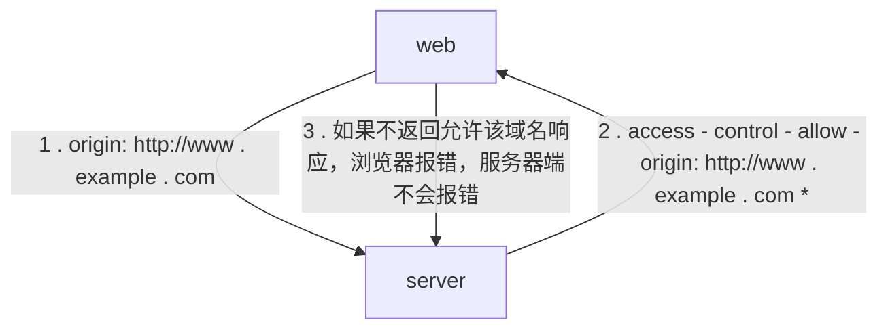
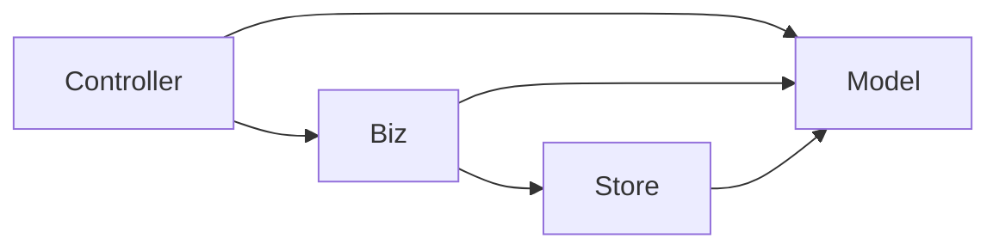
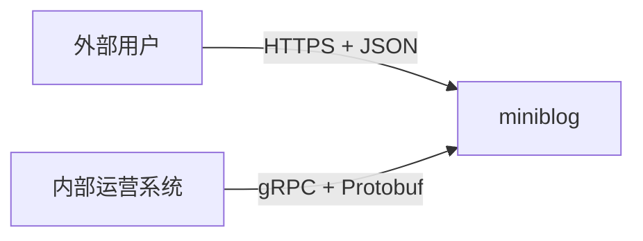

```bash
├── api # Swagger / OpenAPI 文档存放目录
|—— build # 打包和持续集成
├── cmd # 项目的主要应用程序
│   └── myapp
│       └── myapp.go # 通常是最小的 main 函数
├── configs # 配置文件存放目录
├── docs # 项目文档
│   ├── devel # 开发文档
│   ├── guide # 用户文档
│   └── images # 项目图片存放目录
|—— deployments # 容器和容器编排
├── examples # 示例源码
├── go.mod
├── go.sum
├── init # 系统初始化和进程管理配置
├── internal # 内部代码保存目录，这里面的代码不能被外部程序引用，该目录可以被定义在任意目录
│   ├── myapp # 应用实际代码
├── LICENSE # 声明代码所遵循的开源协议
├── Makefile # Makefile 文件，一般大型软件系统都是采用 make 来作为编译工具
├── _output # 临时文件存放目录
├── pkg # 可供外部程序直接使用的 Go 包存放目录
│   ├── api # REST API 接口定义存放目录
├── scripts # 脚本文件
|── third_party # 第三方 Go 包存放目录
|  └── github.com
|—— test 
|__ web # 静态文件存放目录

```

### 创建项目

- 项目名称
    - 项目名称过长使用 `-` 分隔
- 初始化项目为 `Go`
    - `go mod init` # 初始化当前模块为 `Go`
    - `go work use .` # 添加当前模块到 `Go` 工作区

### 应用组成及构建

- 应用配置
    - 命令行选项
    - 命令行参数
        - `os`
        - `flag`
        - `pflag`
    - 配置文件
        - `viper`
    - 环境变量
        - 敏感内容，测试
    - 分布式配置存储
- 应用业务逻辑
    - 初始化缓存
    - 初始化创建数据库端
    - 初始化创建其他服务客户端
    - 启动应用
    - 启动异步任务
- 应用启动框架
    - `cobra`

### 添加版本功能

可以帮助我们根据日志信息快速定位到报错的代码片段

- 好处
    - 快速定位到仓库快照
    - 方便知道用户使用的是什么版本
    - 程序自检更新
    - 版本号，告知使用者额外在状态
- 方案
    - 额外维护一个 `version.txt` 的文件
    - 修改源码
    - `-ldflags`

### 使用跨域资源来跨域

在前后端分离中，因为域名不一致，所以会触发浏览器的同源策略限制，导致请求失败
同源策略是一种约定，它是浏览器最核心的同源策略，组织一个域的 `javascript` 脚本和另一个域的内容交互

- 限制
    - 无法读取非同源网页的 `cookie`，`LocalStorage` 和 `IndexDB`
    - 无法接触非同源网页的 `DOM`
    - 无法向非同源地址发送 `Ajax` 请求
- 解决方案
    - `CORS`
        - 简单请求
            - 方法为 `Get`, `HEAD` 或者 `POST`
            - `HTTP` 请求头只包含 `Accept/Accept-Language/Content-Language/Last-Event-ID/Content-Type`，且 `Content-Type`
              只能是`application/x-www-form-urlencoded`、`multipart/form-data` 或者 `text/plain`
            - 简单请求会在请求头加上 `Origin` 字段，来标明当前的源
        - 复杂请求
        - 浏览器如果发现是 `AJAX` 请求跨源，就会自动添加一些附加的头信息，复杂请求会增加一次附加的预检查
    - `Nginx` 反向代理

> 一个资源去访问另一个不同源的资源时，就会发出跨域请求。如果此时另一个资源不允许进行跨域资源访问，访问资源就会遇到跨域问题



### 关停功能

服务器需要重启，在服务器进程停止时，可能需要做一些处理工作

- 正在执行的 `HTTP` 请求需要等请求执行完再返回，否则请求就会报错
- 异步处理任务，需要将缓存中的数据处理完成，否则会造成数据丢失或者不一致
- 关闭数据库连接，否则数据连接池会保存一个无用的连接
- 常见的终止服务进程
    - `CTRL + C` 发送实际的 `SIGINI`
    - `kill <pid>` 向指定进程发送 `SIGTERM`
    - `kill -9 <pid>` 向指定进程发送 `SIGKILL`，信号无法被应用程序捕获，也无法被阻塞或者忽略
- 使用 `os/signal` 用来监听并反馈信号

### 错误代码

- 用户调用 `API` 接口之后，服务端返回的错误信息可能会发生变化
- 宽泛的错误无法定位
- 实现
    - 不论请求成功还是失败都返回 `200`，在 `HTTP Body` 中包含错误信息
        - 既需要判断 `HTTP` 状态码，还需要判断业务错误代码
    - 返回 `400` 错误码，并在 `Body` 中返回错误信息和自定义业务代

### 架构

为了方便测试代码，最好的方式是先开发依赖少的组件



##### `Model` 层

数据库字段的结构体映射

##### `Store` 层

- 创建一个结构体，用来创建 `store` 层实例；包含一个 `*gorm.DB` 用于 `CURD`
- 创建一个 `New` 函数，返回 `store` 层实例
- 为了方便调用 `store` 包，创建一个包级别的实例

##### `Biz` 层

##### `Controller` 层

### 安全

- 认证
    - 基础验证（用户名密码）
    - 摘要验证 `Digest`
    - 开放授权 `oAuth`
    - 令牌
- 授权
- 网络环境

##### `JWT`

基础验证加令牌认证，如果每次都需要传入用户名和密码，因为涉及到查询数据及验证，接口的执行效率会比较低。
第一次登录之后会产生一个有一定期限的 `token` 文件，之后的请求都会携带这个 `token`
服务器端会将这个 `token` 用文件、数据库或者缓存服务器等方式存下。直接使用密钥对用户信息和时间戳进行签名对称加密

- 格式
    - `header`
        - 类型
        - 加密算法
    - `payload`
        - 具体内容信息包含常用的标准字段
    - `signature`
        - 签名介绍
        - 使用 `Base64` 对 `header.payload` 进行编码
        - 用 `Secret` 对编码后的内容进行加密，加密之后的内容
- 实现
    - 提供用户登录接口
    - 后端接收到登录请求之后，查询数据库，比对密码，签发 `token`

### 应用授权

- 常见模型
    - 权限访问控制列表 `ACL`
    - 自主访问控制 `DAC`
    - 强访问控制 `MAC`
    - 基于角色的访问控制 `RBAC`
    - 基于属性的权限验证 `ABAC`
- 开发
    - 开发中间件用来管理授权
    - 添加用户时添加授权策略

### 应用安全

- `HTTP`
    - 以明文的方式传输数据，数据容易被泄露
- `HTTPS`
    - 基于 `HTTP` 协议加入 `SSL` 安全层，通过加密通道进行数据传输
    - 单向和双向的认证
    - 使用
        - 数据传输加密能力，开启 `HTTPS` 单向认证，验证服务端合法性，服务端对客户端验证采用其他方式
        - 数据传输加密，使用双向验证

##### `CA` 证书

常见开发中，通常自己生成根证书和根证书私钥，给其他服务端和客户端签发证书

- 生成根证书私钥
    - `openssl genrsa -out ca.key 1024`
- 生成请求文件
    - `openssl req -new -key ca.key -out ca.csr -subj "/C=CN/ST=Guangdong/L=Shenzhen/O=devops/OU=it/CN=127.0.0.1/emailAddress=test@qq.com"`
- 生成根证书
    - `openssl x509 -req -in ca.csr -signkey ca.key -out ca.crt`
- 生成服务端证书
    - `openssl genrsa -out server.key 1024`
- 生成服务端公钥
    - `openssl rsa -in server.key -pubout -out server.pem`
- 生成服务端申请签名的 `CSR`
    - `openssl req -new -key server.key -out server.csr -subj "/C=CN/ST=Guangdong/L=Shenzhen/O=serverdevops/OU=serverit/CN=127.0.0.1/emailAddress=test@qq.com"`
- 生成带有签名的证书
    - `openssl x509 -req -CA ca.crt -CAkey ca.key -CAcreateserial -in server.csr -out server.crt`
- 生成客户端私钥
    - `openssl genrsa -out client.key 1024`
- 生成客户端公钥
    - `openssl rsa -in client.key -pubout -out client.pem`
- 生成客户端申请签名的 `CSR`
    - `openssl req -new -key client.key -out client.csr -subj "/C=CN/ST=Guangdong/L=Shenzhen/O=clientdevops/OU=clientit/CN=127.0.0.1/emailAddress=nosbelm@qq.com"`
- 生成客户端带有签名的证书
    - `openssl x509 -req -CA ca.crt -CAkey ca.key -CAcreateserial -in client.csr -out client.crt`

### `GRPC`

内部接口使用 `RPC` 服务，内部服务调用，需要更加关注性能。

- 调用流程
    - `Client` 通过本地调用，调用 `Client Stub`
    - `Client Stub` 将参数打包 （`Marshalling`）成一个消息，然后发送这个消息
    - `Client` 所在的 `OS` 将消息发送给 `Server`
    - `Server` 接收到消息，将消息传递给 `Server Stub`
    - `Server Stub` 将消息解包（`Unmarshalling`）成参数
    - `Server Stub` 调用服务端的子程序，处理完之后将数据按照反方向传递给 `Client`
- `Protocol Buffer`
    - 更快的数据传输速度，数据传输的时候会将数据转为二进制，可以节省大量的 `IO`
    - 数据扩展和兼容
    - 基于 `IDL` 文件定义服务，生成指定语言的数据结果，服务端和客户端接口

##### 文件定义

- 文件头定义
  - 首个非空非注释行必须注明 `protobuf` 版本
  - `option` 可以进行设置，`go_package` 为必需的设置，同时为导包路径
- 服务定义
- 消息定义（接口参数）
  - `singular`
    - 默认值，这个字段可以出现 `0` 次或者 `1` 次
  - `optional`
    - 该字段为可选字段
  - `repeated`
    - 字段可以重复任意，可以看作一个数组



### 其他

##### 赋值语句确保结构体实现期望接口

编译期间能给发现能给确保实现期望接口

```go
var _ Istore = (*datastore)(nil)
```