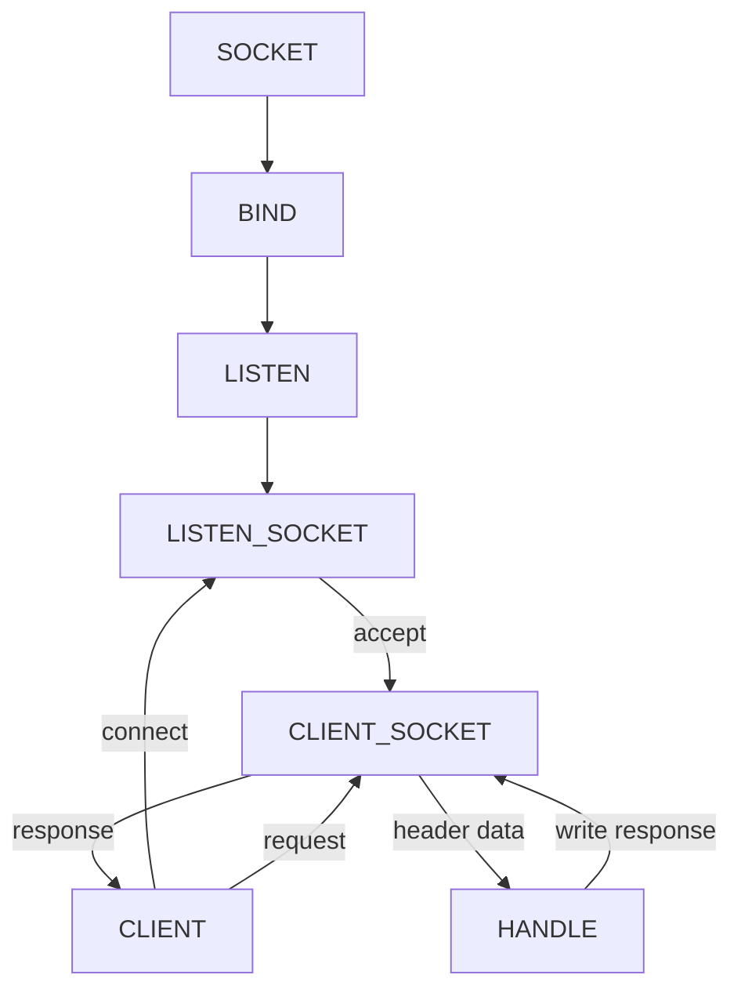

# `http` 包

运行机制

- 如何监听端口
- 如何接受客户端请求
- 如何分配 `handler`

核心功能

- `Conn`
    - 使用 `goroutines` 来处理 `Conn` 的读写事件，这样每个请求都能保证独立
- `ServeMux`



```go
c, err := srv.newConn(rw)
if err != nil {
continue
}
go c.serve()

type ServeMux struct {
mu sync.RWMutex //锁，由于请求涉及到并发处理，因此这里需要一个锁机制
m  map[string]muxEntry // 路由规则，一个string对应一个mux实体，这里的string就是注册的路由表达式
hosts bool             // 是否在任意的规则中带有host信息
}

type muxEntry struct {
explicit bool    // 是否精确匹配
h        Handler // 这个路由表达式对应哪个handler
pattern  string  //匹配字符串
}

type Handler interface {
ServeHTTP(ResponseWriter, *Request) // 路由实现器
}
```

### 表单

- `r.Method`
    - 获取请求方法
- `r.ParseForm()`
    - `Handler` 默认不会解析表单，需要显式的调用该方法

验证表单输入

- 不同表单留空的处理
    - 文本框，上传文件；空值
    - 未选中复选框和单选框；无条目
        - `r.Form.Get()`
- 限定数字
    - 转成 `int` 类型
    - 正则
- 中文
    - `unicode` 包
    - 正则
- 跨站脚本
    - 验证数据
    - 对所有输出数据进行处理，防止注入的脚本在浏览器运行
        - `html/template` 使用转义方法
- 防止重复提交表单
    - 表单中添加一个带有唯一值的隐藏字段
- 文件上传
    - `r.ParseMultipartForm` 上传文件存在内存里面，如果文件大小超出设定的内存会将剩下的文件存储在临时文件中

### 数据库

内置不支持数据库，内置支持 `database/sql`，可以根据接口实现驱动

- `sql.Register`
    - 注册数据库驱动，第三方开发数据库驱动时，会实现 `init` 函数，里面调用的就是这个
    - 可以同时注册多个数据库驱动，只要不重复
- `driver.Driver`
    - 数据库驱动的接口
    - `Open(name string)`
        - 返回一个数据库的 `Conn` 接口，返回的接口只能进行一次 `goroutine`
            - 多个会导致数据混乱
- `driver.Conn`
    - 数据库连接的接口，只能用于一个 `goroutine`
- `driver.Stmt`
    - 一种准备好的状态，和 `Conn` 相关联
- `driver.Tx`
    - 事务处理，提交或者回滚

```go
import (
"database/sql"
_ "github.com/mattn/go-sqlite3" // _ 的意思是引入后面的包名而不直接使用这个包中定义的函数，变量等资源
)

```

##### 使用 `mysql`

- `sql.Open("mysql", "user :password@tcp(127.0.0.1:3306)/dbname")`
    - 用来打开一个注册过的数据库驱动
        - 数据库驱动
        - `DSN`
- `db.Prepare("sql")`
    - 返回需要执行的 `sql` 操作，返回准备执行完毕的状态
- `stmt.Exec()`
    - 执行准备好的语句

##### 使用 `sqlite3`

`db, err := sql.Open("sqlite3", "./name.db")`

### 数据存储

##### `cookie`

`http.SetCookie(w ResponseWriter, cookie *Cookie)`

```go
cookie := http.Cookie{Name: "username"}
http.SetCookie(w, &cookie)
cookie, _ := r.Cookie("username")
```

##### `session`

服务器为每个会话维护一份信息数据，客户端和服务器依靠一个全局唯一标识来访问这份数据

- 生成全局唯一标识符
- 开辟数据空间存储，也可以持久化
- 唯一标识发送给客户端
    - `cookie`
        - 服务端通过设置 `Set-cookie` 将唯一标识发送过去，之后客户端请求会带上它
    - `url` 重写
        - 返回给用户的页面的所有 `URL` 后面追加唯一标识符
- 设计
    - 全局 `session` 管理器
    - 保证 `sessionid` 的全局唯一性
    - 为每个客户关联一个 `session`
    - 存储
    - 过期处理

### 文本处理

##### `XML`

- `func Unmarshal(data []byte, v interface{}) error`
    - 接受 `XML` 数据流
    - 需要输出的结构

##### `json`

- `func Unmarshal(data []byte, v interface{}) error`
- `func Marshal(v interface{}) ([]byte, error)`

##### 模板处理

`template`包里面含有模板处理的一些方法可以从文件或者字符串中加载模板，然后执行展示模板的操作

```go
func handler(w http.ResponseWriter, r *http.Request) {
t := template.New("some template") //创建一个模板
t, _ = t.ParseFiles("tmpl/welcome.html") //解析模板文件
user := GetUser() //获取当前用户信息
t.Execute(w, user) //执行模板的merger操作
}
```

### `Web` 服务

##### `socket`

`socket` 来源于 `Unix`，网络的 `socket` 数据传输是一种特殊的 `I/O`，`Socket` 也是一种文件描述符；常用的有两种流式和数据报，流式是面向连接的，数据报是无连接的
通信方式

- 唯一标识（`ip + 协议 + 端口`）
- `net.IP`
- `TCP socket`
    - 服务端需要监听某个端口，客户端需要向远端某台机器的某个端口发送请求
    - `net.TCPConn`
        - 用在客户端和服务端读写数据
    - 客户端
        - `func DialTCP(network string, laddr, raddr *TCPAddr) (*TCPConn, error)`
        - 建立一个 `TCP` 连接
    - 服务器
        - `net.ListenTCP`
- `UDP socket`
    - 服务端处理多个客户端请求包的方式不同，缺少对客户端连接请求的函数

##### `web socket`

实现基于浏览器的远程 `socket`，使得浏览器和服务器可以进行全双工通讯
之前为了实现即时通讯，采用的技术都是轮询

### 国际化

根据特定的 `locale` 信息，提取与之对应的字符串或者其他信息

- 确定 `locale`
- 保存相关的信息
- 提取对应的字符串和其他信息

##### 设置 `locale`
- 应用运行的时候采用域名分级的方式
  - `www..com`
  - `www..cn`
- 从域名参数设置
  - `www..com/?locale=zh`
- 客户端设置地区
  - 头中设置 `Accept-Language`