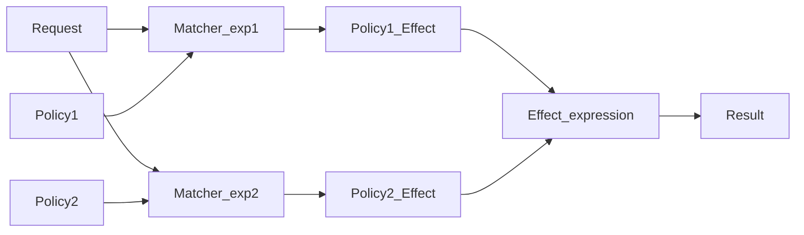

# `Go` 库

### `Flag`

提供方便的接口来解析命令行参数

```go
// 格式一
variableName := flag.[T]("cmd name", "default value", "some descriptive information")

// 格式二
var variableName T
flag.[T]Var(&variableName, "cmd name", "default value", "some descriptive information")

func usage() {
fmt.Fprintf(os.Stderr, "Usage: %s [options] [args]\n", os.Args[0])
flag.PrintDefaults()
}

var debug = flag.Bool("debug", false, "Enable debug mode.")
flag.Usage = usage // 用于显示命令行标志参数的使用说明
flag.Parse()

```

### `PFlag`

用来替代标准库 `flag` 兼容 `flag` 并提供更加强大的功能，常用在构建大型项目

- 支持丰富的参数类型
    - 基本类型
    - 高级类型
        - `ip`
        - `ipmask`
- 兼容 `flag`
    - `Flag`
    - `FlagSet`
- 其他
    - `hidden`

###### `Flag`

```go
type Flag struct {
Name                string // flag 长选项的名称
Shorthand           string // flag 短选项的名称，一个缩写的字符
Usage               string // flag 的使用文本
Value               Value  // flag 的值
DefValue            string // flag 的默认值
Changed             bool   // 记录 flag 的值是否有被设置过
NoOptDefVal         string // 当 flag 出现在命令行，但是没有指定选项值时的默认值
Deprecated          string // 记录该 flag 是否被放弃
Hidden              bool   // 如果值为 true，则从 help / usage 输出信息中隐藏该 flag
ShorthandDeprecated string // 如果 flag 的短选项被废弃，当使用 flag 的短选项时打印该信息
Annotations         map[string][]string // 给 flag 设置注解
}

// 可以通过接口自定义 Flag 值类型
type Value interface {
String() string // 将 flag 类型的值转换为 string 类型的值，并返回 string 的内容
Set(string) error // 将 string 类型的值转换为 flag 类型的值，转换失败报错
Type() string     // 返回 flag 的类型，例如：string、int、ip等
}

```

###### `FlagSet`

预先定义的 `Flag` 的集合，提供操作方法

- 创建
    - 使用 `NewFlagSet`
    - 使用包里提供的全局变量 `CommandLine`，也是使用第一种方式创建的
        - 不需要定义子命令的命令行工具

```go
var version bool
flagSet := flag.NewFlagSet("myapp", flag.ContinueOnError)
flagSet.BoolVar(&version, "version", "v", false, "show version")
```

###### 使用方法

- 兼容标准库 `flag`
    - `import flag "github.com/spf13/pflag"`
- 支持多命令行参数定义
    - 长选项、默认值和使用文本
        - `var name = pflag.String("name", "colin", "Input Your Name")`
    - 长选项、短选项、默认值和使用文本
        - `var name = pflag.StringP("name", "n", "colin", "Input Your Name")`
- 获取参数值 `Get<Type>`
    - `i, err := flagset.GetInt("flagname")`
- 解析定义的标志
    - `pflag.Parse()`
- 获取非选项参数
    - `pflag.Args()`
- 弃用标志或者标志简写
    - 隐藏帮助文档
    - `pflag.CommandLine.MarkDeprecated("logmode", "please use --log-mode instead")`
- 保留标志，弃用简写
    - `pflag.IntVarP(&port, "port", "P", 3306, "MySQL service host port.");pflag.CommandLine.MarkShorthandDeprecated("port", "please use --port only")`
- 隐藏标志
    - 可以使用，文档不显示
    - `pflag.CommandLine.MarkHidden("secretFlag")`
- 禁止排序
    - `pflag.CommandLine.SortFlags = false`
- 支持标准库 `flag`
    - `goflag "flag"`
    - `flag "github.com/spf13/pflag"`
    - `flag.CommandLine.AddGoFlagSet(goflag.CommandLine)`
- 自定义标志

### `Viper`

配置解析库，支持多种配置格式的解析和快速获取目标值

- 支持默认配置
- 从不同格式文件中读取数据
- 实时监控和重新读取配置
- 从环境变量中读取配置
- 从远程配置系统
    - `etcd`
    - `Consul`
- 从命令行参数读取配置
- 支持从 `buffer` 中读取配置
- 可以显式的给配置项设置值

可以从不同的位置读取配置，不同的位置的配置具有不同的优先级

1. `viper.Set` 函数显式设置配置
    - `viper.Set("user.username", "colin")`
2. 命令行参数
3. 环境变量
4. `key/value` 存储
5. 默认值

##### 读入配置

- 设置默认配置文件
- 读取配置文件
- 监听和重新读取配置文件
- 从 `io.Reader` 中读取
- 环境变量
- 命令行标志
- 远程 `key/value` 存储

```go
viper.SetDefault("ContentDir", "content") // 默认值

viper.SetConfigFile("a.yml")
viper.SetConfigType("yaml") // 如果配置文件没有扩展名，需要指定文件类型

viper.AddConfigPath(".") // 把当前目录加入到配置文件的搜索路径中
viper.AddConfigPath("$HOME/.iam") // 配置文件搜索路径，可以设置多个配置文件搜索路径；需要注意顺序，找到就停止搜索
viper.SetConfigName("config") // 配置文件名称（没有文件扩展名）
```

##### 写入配置

- `WriteConfig`
    - 配置文件不存在报错，存在覆盖
- `SafeWriteConfig`
    - 不存在报错，存在返回 `file exists` 错误
- `WriteConfigAs`
- `SafeWriteConfigAs`

##### 监听和重新读取配置

运行时让应用程序实时读取配置

```go
viper.WatchConfig()
viper.OnConfigChange(func(e fsnotify.Event) {
// 配置文件发生变更之后会调用的回调函数
fmt.Println("Config file changed:", e.Name)
})

```

##### 别名

允许多个键引用

```go
viper.RegisterAlias("a", "b")
viper.Set("b", "value")
fmt.Println(viper.Get("a"))
fmt.Println(viper.Get("b"))

```

##### 环境变量

读取环境变量会区分大小写

- `AutomaticEnv()`
- `BindEnv(input ...string) error`
    - 键名和环境变量名绑定
- `SetEnvPrefix(in string)`
    - 设置读取环境变量的前缀
- `SetEnvKeyReplacer(r *strings.Replacer)`
    - 可以重写环境变量键
- `AllowEmptyEnv(allowEmptyEnv bool)`

##### 标记

可以和 `pflag` 一起使用，将 `key` 绑定到 `flag`，绑定时不会设置值，在访问时才会设置

- 单个绑定
    - `viper.BindPFlag("token", pflag.Lookup("token"))`
- 全绑定
    - `viper.BindPFlags(pflag.CommandLine) `

##### 读取配置

- `Get(key string) interface{}`
- `Get<Type>(key string) Type`
- `AllSettings() map[string]interface{}`
- `IsSet(key string) bool`
- 访问
    - 访问嵌套 `.`
        - `v := viper.NewWithOptions(viper.KeyDelimiter("::"))` 修改分隔符
    - 提取子树 `Sub(key)`
    - 反序列化
        - `Unmarshal(rawVal interface{}) error`
        - `UnmarshalKey(key string, rawVal interface{}) error`
        - 如果需要解析键中本身含有 `.` 的配置，需要修改分隔符
    - 序列化
        - `yaml.Marshal(c)`

### `Cobra`

创建 `CLI` 应用程序的库，提供一个生成应用和命令文件的工具 `cobra-cli`

- 构建基于子命令的的 `CLI`，支持嵌套子命令
- 使用 `cobra-cli` 生成应用和子命令
- 自动生成命令和 `help` 文本
- 自动补全

##### `cobra-cli`

- 子命令
    - `init`
    - `add`
    - `completion`
    - `help`
- 全局参数
    - `-a` `--author`
    - `--config`
    - `-l` `--license`
    - `--viper`
- 快速使用
    1. `cobra-cli init` 初始化一个应用程序
    2. `cobra-cli add serve` `cobra-cli add config` 添加命令
    3. `go build -v .` 编译

##### 创建命令

```go
// cmd/root.go

var rootCmd = &cobra.Command{
Use:   "app",
Short: "A brief description of your application",
Long: `A longer description that spans multiple lines and likely contains examples`
Run: func (cmd *cobra.Command, args []string) {
...
},
}

func Execute() {
if err := rootCmd.Execute(); err != nil {
...
}
}

```

标志和配置

```go

func init() {
cobra.OnInitialize(initConfig)
rootCmd.PersistentFlags().StringVar(&cfgFile, "config", "", "config file (default is $HOME/.cobra.yaml)")
}

func initConfig() {
viper.SetConfigFile(cfgFile)
viper.SetConfigName(".cobra")
}

```

##### `pflag` 联合

- 持久化标志
    - 可以用于他分配的命令以及子命令
    - `rootCmd.PersistentFlags().BoolVarP(&Verbose, "verbose", "v", false, "verbose output")`
- 使用本地标志
    - 只能使用在其绑定的命令上
    - `rootCmd.Flags().StringVarP(&Source, "source", "s", "", "Source directory to read from")`
- 标志绑定到 `viper`
    - `rootCmd.PersistentFlags().StringVar(&author, "author", "YOUR NAME", "Author name for copyright attribution")`
    - `viper.BindPFlag("author", rootCmd.PersistentFlags().Lookup("author"))`
- 设置标志必选
    - `rootCmd.Flags().StringVarP(&Region, "region", "r", "", "AWS region (required)")`
    - `rootCmd.MarkFlagRequired("region")`
- 非选项参数验证
    - 内置函数验证
    - 自定义验证
- `Help` 命令
  - 

### `Net/Http`

用于构建 `HTTP` 服务器和客户端

### `Context`

上下文，用来实现多函数中传递相关值，设置请求截止日期等的重要接口，与 `Goroutine` 一起可以实现对函数调用的链路控制

- `Deadline` 返回被取消的时间，也就是完成工作的截止日期；

- `Done` 返回一个 `Channel`，会在当前工作完成或者上下文被取消后关闭

- `Err` 返回 `Context` 结束的原因，它只会在 `Done` 方法对应的 `Channel` 关闭时返回非空的值；

    - 如果 `Context` 被取消，会返回 `context canceled` 错误；

    - 如果 `Context` 超时，会返回 `context deadline exceeded` 错误；

    - `Value` 从 `Context` 中获取键对应的值，对于同一个上下文来说，多次调用 Value 并传入相同的 Key
      会返回相同的结果，该方法可以用来传递请求特定的数据

### `Gin`

轻量级 `Web` 框架

- 请求方法
- 响应格式
    - `c.JSON` `c.YAML`
- 参数绑定
    - 路径参数
    - `Get Post` 参数
- 参数校验
- 文件上传
- 路由分组
- 中间件
- 自定义日志

```go
import (
"github.com/gin-gonic/gin"
)

func main() {
r := gin.Default()
r.GET("/ping", func (c *gin.Context) {
c.JSON(200, gin.H{ // 返回 Json 格式的数据
"pong": "pong"
})
})
}

func GetMethod(c *gin.Context) {
firstName := c.Query("firstName", "Guest") // 解析路由参数
lastName := c.DefaultQuery("lastName", "Gopher")
c.String(http.StatusOK, "Hello %s %s", firstName, lastName)
}

func PostMethod(c *gin.Context) {
nick := c.DefaultPostForm("nick", "anonymous") // 解析表单参数
message := c.PostForm("message")

c.JSON(200, gin.H{
"status":  "posted",
"message": message,
"nick":    nick,
})
}

func main() {
router := gin.Default()
router.GET("/welcome", GetMethod)
router.POST("/form", PostMethod)
}

// 绑定
type Person struct {
ID   string `uri:"id" binding:"required,uuid"`
Name string `uri:"name" binding:"required"`
}
if err := c.ShouldBindUri(&person); err != nil {
c.JSON(400, gin.H{"msg": err.Error()})
return
}

```

##### 添加中间件

`web` 中间件是 `HTTP/RPC` 请求必经的一个中间层，该中间层可以统一的处理所有的请求，起到前拦截和后拦截的效果
中间件常用于权限验证，日志记录，数据过滤等场景

- 分类
    - 全局中间件
        - 通过默认路由来设置全局路由
        - `r.Use`
    - 路由组中间件
        - 声明路由组的同时设置路由中间件
            - `authorized := r.Group("/users", AuthRequired())`
        - 先声明路由组然后在 `Use` 方法进行设置
            - `authorized := r.Group("/users")`
            - `authorized.Use(AuthRequired())`
    - 单个路由中间件
        - 仅对一个路由起作用
        - `r.GET("/users/:id", GetUser())`

### `log` 标准库

使用需要创建一个 `*log.Logger` 类型的实例，所有的日志输出都是通过它实现的，提供全局变量 `std`

- 创建
    - `logger := log.New(logFile, "[Debug]", log.Lshortfile)`
        - 日志属性可以选择
- 配置
    - `SetOutput`
    - `SetPrefix`
    - `SetFlags`
- 记录日志
    - `Print`
    - `Panic`
    - `Fatal`

### `glog`

轻量级的，比标准库提供更多功能

- 日志级别
    - `INFO`
    - `WARNING`
    - `ERROR`
    - `FATAL`
- 支持命令行选项
- 根据文件大小切割日志
- 日志按照级别分量输出
- 开发者自定义级别
- 使用
    - `vmodule` 功能
        - `V` 越小，说明日志级别越高

```go
package main

import (
	"flag"

	"github.com/golang/glog"
)

// 简单使用
func main() {
	glog.MaxSize = 1024 * 1024
	flag.Parse()
	defer glog.Flush()
	glog.Info("hello")
}

// vmodule 功能
func main() {
	glog.V(3).Info("Hello")
}
```

### `logrus`

- 日志级别
    - `Debug`
    - `Info`
    - `Warn`
    - `Error`
    - `Fatal`
    - `Panic`
- 可扩展
    - 可以使用 `hook` 的方式将日志分发到任意地方
- 自定义日志格式
- 结构化日志
- 预设字段
    - 给日志添加一个共同的字段
- `Fatal handlers`
    - 允许注册一个或者多个，用于程序需要关闭

- 使用
    - `Default Fields`
        - `logrus.WithFileds(logrus.Fields{"id": id})`

```go
package main

import (
	"os"

	"github.com/sirupsen/logrus"
)

func main() {
	logrous.SetFormatter(&logrus.JSONFormatter{})
	logrous.SetOutput(os.Stdout)
	logrous.SetLevel(logrus.InfoLevel)
	logrous.Info("Hello")
}
```

### `zap`

- 支持常用的日志级别
- 高性能
- 支持结构化的日志记录
- 支持针对特定级别，输出调用堆栈
- 支持 `hook`

默认的日志输出格式为 `JSON`，并记录文件名和行号

- 创建 `logger`
    - `zap.NewProduction()`
    - `zap.NewExample()`
    - `zap.NewDevelopment()`
    - 性能更加高，但是只支持结构化日志，需要指定具体类型和 `key-value` 格式的日志字段
- 同步日志
    - `defer logger.Sync()`
        - 将缓存中的日志刷新到磁盘
- `sugaredLogger`
    - 更加便捷，性能比较低
- 定制 `logger`
- 选项
    - `AddStacktrace(lvl zapcore.LevelEnabler)`
- 预设日志字段
    - 每条日志加一些公共字段，可以在创建 `logger` 时使用 `Fields` 选项 (`userID`)
        - `logger := zap.NewExample(zap.Fields(zap.Int("userID", 10)))`
- 全局 `Logger`
    - `*zap.Logger`
    - `*zap.SugaredLogger`

```go
package main

import (
	"go.uber.org/zap/zapcore"
	"time"

	"go.uber.org/zap"
)

func main() {
	logger, _ := zap.NewProduction()
	defer logger.Sync()
	url := "http://example.com"
	logger.Info("Failed to fetch URL",
		zap.String("url", url),
		zap.Int("attempt", 3),
		zap.Duration("backoff", time.Second),
	)

	sugar := logger.Sugar()
	sugar.Infow("Failed to fetch URL",
		sugar.Infof("Failed to fetch URL: %s", url)
}

// 定制 logger
func main() {
	rawJson := []byte(`{
  "level": "debug",
  "encoding": "json",
  "outputPaths": ["stdout", "test.log"],
  "errorOutputPaths": ["stderr"],
  "encoderConfig": {
    "messageKey": "message",
    "levelKey": "level",
    "levelEncoder": "lowercase",
  }
  }`)

	var cfg zap.Config
	if err := json.Unmarshal(rawJson, &cfg); err != nil {
		panic(err)
	}
	logger, err := cfg.Build()
	if err != nil {
		panic(err)
	}
	defer logger.Sync()

	logger.Debug("Debug message")
}

type Config struct {
	Level             AtomicLevel
	Development       bool
	DisableCaller     bool
	DisableStacktrace bool
	Sampling          *SamplingConfig
	Encoding          string
	EncoderConfig     zapcore.EncoderConfig
	OutputPaths       []string
	ErrorOutputPaths  []string
	InitialFields     map[string]interface{}
}

```

### `Copier`

- 标签使用
    - `copier:"-"`
        - 复制阶段忽略掉该字段
    - `copier:"must"`
        - 强制复制字段，无法复制直接报错
    - `copier:"must,nopanic"`
- 指定自定义字段名字

```bash
go get -u github.com/jinzhu/copier
```

```go
type SourceEmployee struct {
Identifier int64
}

type TargetWorker struct {
ID int64 `copier:"Identifier"` // Map Identifier from SourceEmployee to ID in TargetWorker
}
```

### `casbin`

- `RBAC` 权限控制，将访问模型抽象到一个基于 `PERM` 模型文件中
    - 支持同时有多个 `RBAC` 系统
    - 支持多层角色，权限关系可以依次传递
- `ACL`
    - 模型在用户和资源都比较少的情况下没什么问题，一旦用户和资源量一大操作就会变得比较繁琐
- `ABAC`
    - 应对特殊的动态的需求
        - 工作时间可以读写数据

- 模型文件
    - `policy`
    - `request`
        - 对访问请求的抽象
    - `matcher`
        - 请求和定义进行匹配，生成结果集
    - `effect`
        - 根据结果集，决定如何处理请求

##### 模型文件

```txt
[request_definition]
r = sub, obj, act

[policy_definition]
p = sub, obj, act
p2 = sub, act

[policy_effect]
e = some(where (p.eft == allow)) # 满足任意一条规则及成立

[matchers]
m = r.sub == p.sub && r.obj == p.obj && r.act == p.act

[role_definition]
g = _, _
g2 = _, _
g3 = _, _, _ # 用户，角色，域
```



# 其他工具

### `db2struct`

```bash
git clone https://github.com/Shelnutt2/db2struct.git
go build -v -o db2struct cmd/db2struct/main.go

db2struct --gorm --no-json -H 127.0.0.1 -d miniblog -t user --package model --struct UserM -u miniblog -p 'miniblog1234' --target=user.go
```
