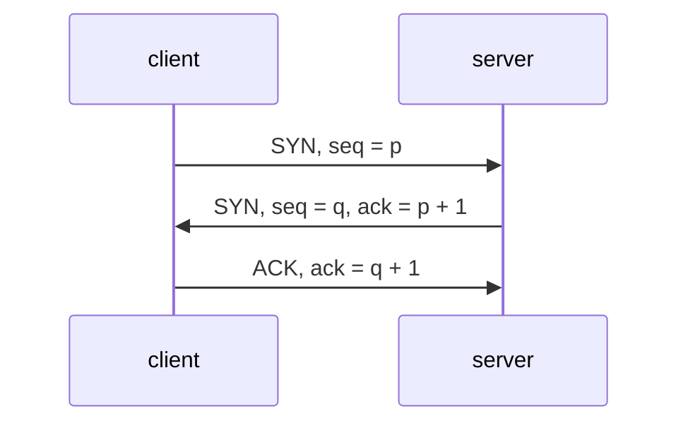
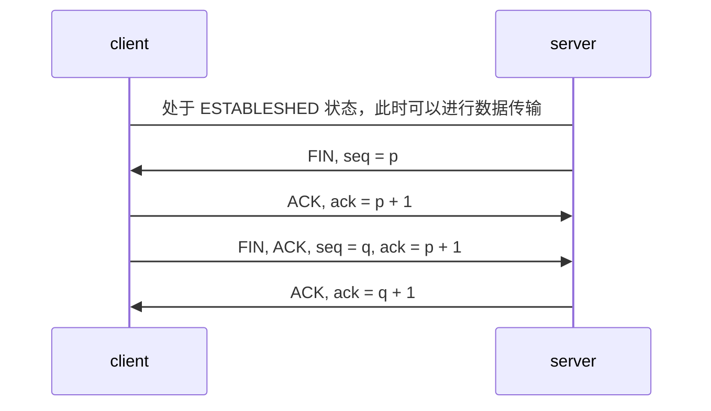

### `multipart/form-data` 请求头

必须包含 `Content-Type` 信息，且其值也必须规定为 `multipart/form-data`
`multipart/form-data` 请求体也是一个字符串，不过和普通的 `post`
构造方式不同。普通的请求体是键值对连接而 `multipart/form-data` 则是添加了分隔符，参数描述符等

```txt
Content-Type: multipart/form-data; boundary=${bound}    

${bound}
Content-Disposition: form-data; name="Filename"
 
HTTP.pdf
${bound}
Content-Disposition: form-data; name="file000"; filename="HTTP协议详解.pdf"
Content-Type: application/octet-stream
 
%PDF-1.5
file content
%%EOF
${bound}
Content-Disposition: form-data; name="Upload"
 
Submit Query
${bound}--
```

> `${bound}` 就请求头信息定义的分隔符

### 自连接

```bash
while true
do
	nc 127.0.0.1 50000
done

执行上述代码一段时间之后，连上了未监听的端口
lsof | grep 50000
nc        45418          root    3u     IPv4             656305       0t0        TCP localhost:50000->localhost:50000 (ESTABLISHED)
```

当一方发起连接时候，操作系统会分配一个随机的端口，如果该端口恰好为 50000

- 发送一个 `SYN` 包
- 接收到 `SYN` 包，尝试建立连接，发送 `SYN + ACK`
- 接收到 `SYN + ACK`，握手成功，进入 `ESTABLISHED`

##### 可能产生的问题：

- 系统服务监听端口，并带有断开重连的功能；重连可能出现端口占用无法访问
- 导致结果，端口无法访问，进程看起来连接状态正常

##### 解决方法：

- 服务器和客户端随机分配的端口不相同
    - `/proce/sys/net/ipv4/ip_local_port_range` 文件决定随机分配的端口范围
- 自连接断开

```GO
func (sd *sysDialer) doDialTCP(ctx context.Context, laddr, raddr *TCPAddr) (*TCPConn, error) {
	fd, err := internetSocket(ctx, sd.network, laddr, raddr, syscall.SOCK_STREAM, 0, "dial", sd.Dialer.Control)

	for i := 0; i < 2 && (laddr == nil || laddr.Port == 0) && (selfConnect(fd, err) || spuriousENOTAVAIL(err)); i++ {
		if err == nil {
			fd.Close()
		}
		fd, err = internetSocket(ctx, sd.network, laddr, raddr, syscall.SOCK_STREAM, 0, "dial", sd.Dialer.Control)
	}

	if err != nil {
		return nil, err
	}
	return newTCPConn(fd), nil
}

func selfConnect(fd *netFD, err error) bool {
	if err != nil {
		return false
	}

	if fd.laddr == nil || fd.raddr == nil {
		return true
	}
	l := fd.laddr.(*TCPAddr)
	r := fd.raddr.(*TCPAddr)
	return l.Port == r.Port && l.IP.Equal(r.IP)
}  
```

### 握手和挥手

##### 三次握手


##### 四次挥手

1. 最开始双发处于 `estableshed` 状态，可以正常数据通讯
2. 服务端希望断开连接，发送 `FIN` 报文给客户端，这个之后服务端不再发送数据，客户端进入 `FIN-WAIT-1` 状态
   > `FIN` 报文实际上就是将 `FIN` 标志位修改为 1
   > `FIN` 是可以携带数据的，可以携带最后要发送的数据。无论是否发送数据，都会消耗一个序列号, 否则不知道回复哪个报文
   > 发送完之后进入到半关闭状态，不再发送数据，但是可以接收数据
3. 客户端收到 `FIN` 报文回复确认 `ACK` 报文给服务端，客户端进入 `CLOSE_WAIT`, 客户端收到 `ACK` 进入 `FIN-WAIT-2`
4. 客户端也不发送数据，发送 `FIN` 报文后，进入 `LAST_ACK` 状态，等待服务端发送 `ACK`
5. 服务端接收到 `FIN`, 回复 `ACK` 来确认上一步发送过来的报文，进入 `TIME-WAIT` 状态，等待两个 `MSL` 进入 `CLOSED` 状态

因为延迟确认机制的存在，通常第三步的 `ACK` 和 `FIN` 会一起发送。
这个行为和应用层关系比较大，如果接收到 `FIN` 不及时回复 `ACK` 死等对面可能导致重发 `FIN`。如果确定没有数据需要继续发送，可以合成一个包

##### 同时关闭
同时关闭的话，两个断开会同时进入到 `TIME_WAIT` 状态


# 工具

### `telnet`

##### 检查端口是否打开

检查端口是否处于打开，`telnet [domainname or ip] [port]` 查看远程端口是否可达

##### 发送 `http` 请求

```bash
telnet www.baidu.com 80

Trying 14.215.177.38...
Connected to www.a.shifen.com.
Escape character is '^]'.
GET / HTTP/1.1
Host: www.baidu.com

HTTP/1.1 200 OK
```

##### 连接 `redis`

```bash
telnet localhost 6379
ping
set mykey "Hello, Redis"
get mykey
```

Redis 服务器和客户端之间使用 `RESP` 协议通讯，通过检查服务器返回数据的第一个字节来确定如何回复

- `Simple Strings`
    - `+`
- `Errors`
    - `-`
- `Integer`
    - `:`
- `Bulk Strings`
    - `$`
- `Array`
    - `*`
      `simple strings` 被用来传输非二进制安全字符串，是按照下面的方式来编码：一个加号，不包含 `CR` 或者 `LF`
      的字符串（不允许换行），最后以 `CRLF` 结尾

### `netcat`

##### 当作聊天服务器

- 服务器
    - nc -l 9000
- 客户端
    - nc IP 9000

##### 发送 `http` 请求

```bash
echo -ne "GET / HTTP/1.1\r\nhost:www.baidu.com\r\n\r\n" | nc www.baidu.com 80
```

##### 查看远程端口

```bash
nc -vz www.baidu.com 80
```

> `-z` 不发送任何数据

##### 访问 `redis`

### `netstat`

```bash
netstat -a
netstat -at # tcp
netstat -au # udp
netstat -l # 处于监听端口
netstat -ltn # 禁止端口映射(22 -> ssh)
p 显示连接归属的进程信息
i 列出网卡信息
```

### `TCPdump`

命令行网络流量分析工具，主要在服务器上定位一些黑盒应用

```bash
tcpdump -i any # -i 指定网卡
tcpdump -i any host 127.0.0.1 # 添加 IP 过滤, (填入的 IP 可以是源地址也可以是目标地址)
tcpdump -i any src 127.0.0.1 # 抓取该地址发出的包
tcpdump -i any dst 127.0.0.1 # 抓取该地址收到的包
tcpdump -i any port 80 # 添加端口过滤
tcpdump portrange 80-90 # 抓取指定端口之间的流量
tcpdump -n -nn # `-n` 禁止解析主机，`-nn` 禁止解析端口
tcpdump -i any udp # 抓取 udp 流量
-A # 显示 ASCII 格式数据
-X # 显示 HEX 和 ASCII
-s 500 # 显示数据包前 500 字节，一般和 —A 配合使用
-c 5 # 之抓取五个报文，抓到五个之后退出
-w test.pcap # 抓取数据包并保存到文件， `.pcap` 文件可以使用 `wireshark` 读取
-S # 查看 `seq` 和 `ACK` 真正编号
```

```bash
# 组合形成过滤器
and (&); or (||); not (!)
tcpdump -i any host 127.0.0.1 and dst port 3306
tcpdump -i any src 127.0.0.1 and not dst port 22
tcpdump -i any 'src 127.0.0.1 and (dst port 3306 or 6379)' # 因为涉及到了 `()` 所以需要使用单引号把复杂的条件组合起来
```

```text
01:23:33.875467 IP 192.168.52.130.62127 > 192.168.52.138.us-cli: Flags [S], seq 3197272862, win 64240, options [mss 1460,nop,wscale 8,nop,nop,sackOK], length 0
时间           TCP 四元组（包的源地址，目标地址， 源端口， 目标端口） SYN 标志  SYN 实际序号  声明接收窗口大小 包含一些重要信息（MSS, window scale, SACK ...） 当前包的长度
01:23:54.070141 IP 192.168.52.138.us-cli > 192.168.52.130.62131: Flags [S.], seq 4100026818, ack 3759579781, win 29200, options [mss 1460,nop,nop,sackOK,nop,wscale 7], length 0
                                                                  SYN + ACK
01:23:54.070233 IP 192.168.52.130.62131 > 192.168.52.138.us-cli: Flags [.], ack 1, win 8212, length 0
                                                                             开始使用相对序号
01:23:56.729258 IP 192.168.52.130.62131 > 192.168.52.138.us-cli: Flags [P.], seq 1:3, ack 1, win 8212, length 2
                                                                        PSH + ACK 此处发送了一个字符串
01:23:56.729286 IP 192.168.52.138.us-cli > 192.168.52.130.62131: Flags [.], ack 3, win 229, length 0
                                                                        收到字符串之后回复的包，表示序号 3 之前的都接收到了
01:24:00.172469 IP 192.168.52.130.62131 > 192.168.52.138.us-cli: Flags [P.], seq 9:12, ack 1, win 8212, length 3
01:24:00.172497 IP 192.168.52.138.us-cli > 192.168.52.130.62131: Flags [.], ack 12, win 229, length 0
01:24:01.465230 IP 192.168.52.130.62131 > 192.168.52.138.us-cli: Flags [R.], seq 12, ack 1, win 0, length 0
```

- `F`
    - `FIN` 标志
- `R`
    - `RST` 标志
- `P`
    - `PSH` 标志
- `U`
    - `URG` 标志
- `.` 没有标志，`ACK` 情况下使用

##### `wireshark`

适合简单的文本协议的分析和处理