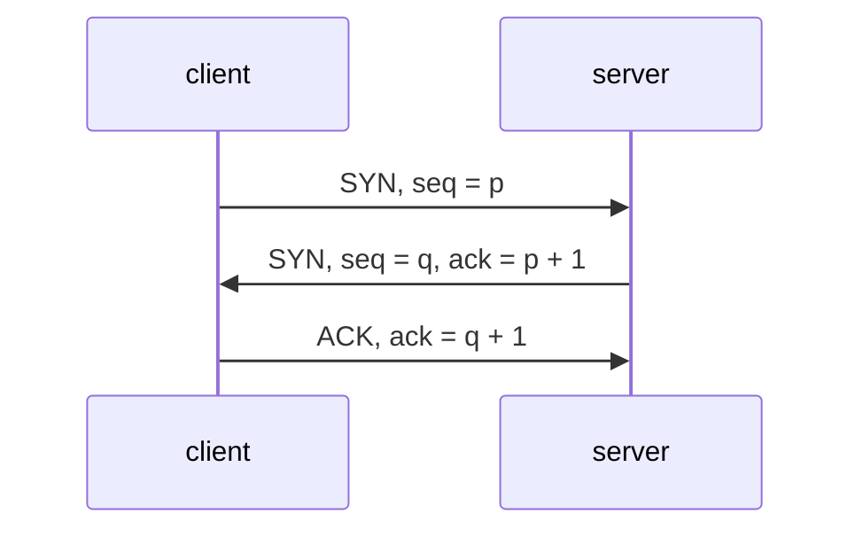
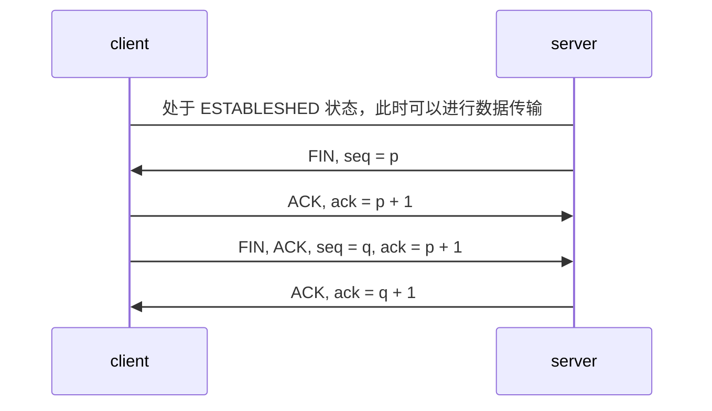
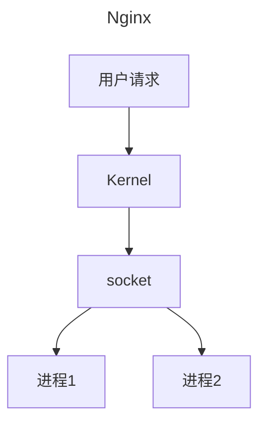
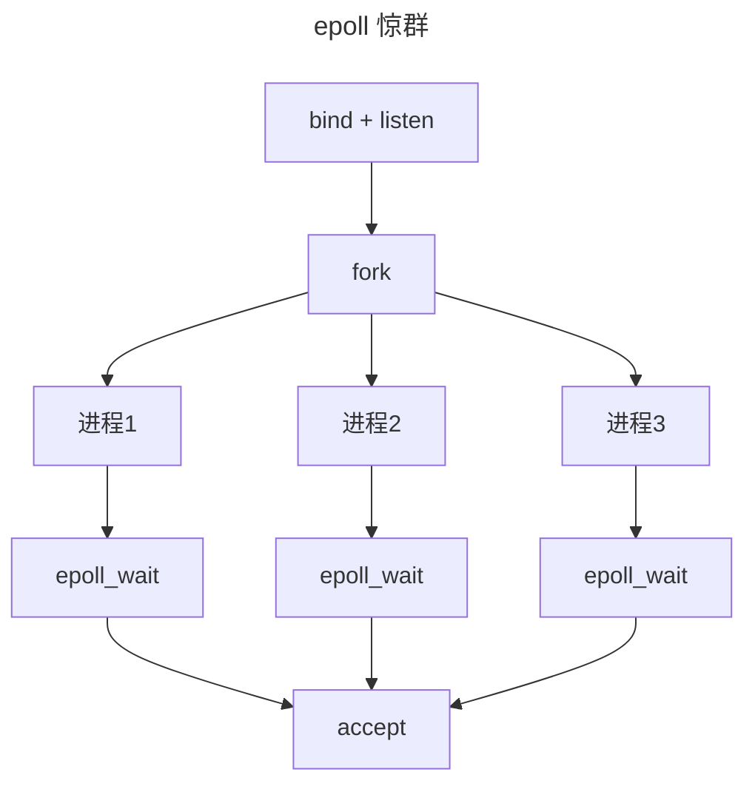
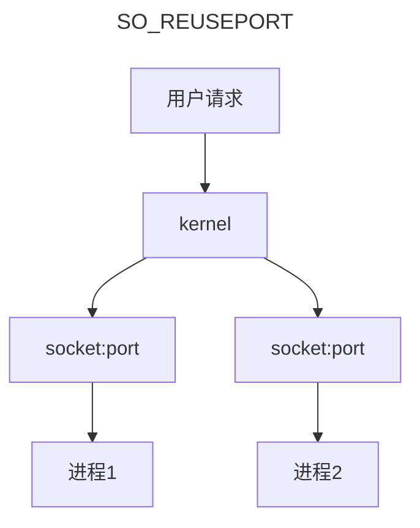

### `TCP/IP` 网络分层
使用 `wireshark` 抓包查看网络分层，过滤器中 `host www.baidu.com`, 查看到协议分层
- Ethernet II
  - 网络接口层以太网帧头部信息
- Internet Protocol Version 4
  - 互联网层 IP 包头部信息
- Transmission Control Protocol
  - 传输层的数据段头部信息，此处是 TCP 协议

##### 应用层
规定了应用层之间如何互相传递报文
- `HHTP`
  - 报文类型
    - 请求报文
    - 响应报文
  - 报文语法
    - 分为几段，各段是什么含义，使用什么分隔，每个字段有什么含义
  - 进程应该以什么样的时序发送和处理报文
- `DNS`
  - 域名解析
- `SMTP` `POP3`
  - 收发邮件
- `NTP`
  - 时钟同步协议
- `NFS`
  - 网络文件共享

##### 传输层
为两台电脑之间提供端到端的逻辑通讯

##### 网络互连层
提供主机到主机的通信，将传输层产生的数据包封装的分组数据包发送到目标机器，并提供路由选择
`IP` 是主要的网络层协议，是无连接协议，不具备重发的机制，因此导致了 `TCP` 的复杂

##### 网络访问层
以太网，蓝牙，Wifi 工作的这一层，提供主机连接到物理网络需要的硬件和相关协议

### `TCP`
面向连接指的是正式发送数据之前需要通过握手建立一个逻辑连接，结束连接的时候也需要使用挥手断开连接
因为 IP 是一种无连接也不可靠的协，他尽可能将数据发送到目标主机，但是不保证数据是否到
TCP 想要在 IP 基础上实现可靠的传输层协议，必须保障可靠性
- 对每个包提供校验和
  - 包首部使用两个字节表示校验和，防止传输过程中损坏
- 序列号解决数据乱序
- 超时重传
- 流量控制和拥塞控制

面向字节流的通信协议
流的定义是没有固定的报文边界，接收方无法知道对面每次写入的字节是多少

双工协议

##### 头部
```text
Frame 1: 78 bytes on wire (624 bits), 78 bytes captured (624 bits) on interface en0, id 0 
Ethernet II, Src: Apple_2f:dc:ab (38:f9:d3:2f:dc:ab), Dst: XiaomiCommun_f1:a3:28((fo:b4:29:f1:a3:28)
Internet Protocol Version 4, Src: 192.168.31.240, Dst: 14.215.177.38 # IP
Transmission Control Protocol, Src Port: 61024, Dst Port: 80, Seq: 0, Len: 0 # TCP 
# 本地源端口号为 61024，百度目标端口号是 80
```
TCP 报文中没有源 IP 和 目标 IP， 所以使用 `wireshark` 抓包的时候不能使用 `tcp.addr = IP` 需要使用 `ip.addr == IP`

```text
Source Port: 61024 
Destination Port: 80
[Stream index: 0]
[Stream Packet Number: 1]
[TCP Segment Len: 0] 
Sequence Number: 0(relative sequence number)
Sequence Number (raw): 1712033978
[Next Sequence Number: 1 (relative sequent number)]
Acknowledgment number （raw):0
```
序列号（`Sequence number`） 是指的本报文段第一个字节的序列号
序列号加上报文长度，就可以确定传输的是那一段数据。序列号是 32 位无符号整数
- `SYN` 序列号用于交换彼此的初始序列号
- 其他报文中用于保证包的顺序

确认号（`Acknowledgment number, ACK`）
告诉对方下一个期望接收到的序列号，小于此确认号字节已经收到
- 不是所有的包都需要确认
- 不是需要马上确认，可以延迟
- `ACK` 包本身不需要被确认
- 小于此确认号的字节都已经收到了

标记
定义了一个 8 位的字段来表示 flags, 但是大部分只用到了后面 6 位
- `SYN`
  - 发起连接，交换初始序列号
- `ACK`
  - 确认数据包
- `FIN`
  - 准备断开连接
- `RST`
  - 强制断开连接
- `PSH`
  - 数据不能缓存，立即交给应用

窗口大小
`window size` 最开始设置只有 16 位，因此引入 `TCP` 窗口缩放来解决这个问题，取值范围是 （0-14） 按照 2^n

最大传输单元（`Maximum Transmission Unit, MTU`）
数据链路层传输的帧大小是有限制的，不能把一个太大的包塞进去，这个限制就是最大传输单元

IP 分段
IPv4 数据报大小远超过 MTU，因此当IP 数据大于 MTU 时会把数据报文进行切割成多个小的 MTU, 使得这些小的报文可以通过数据链路层传输

##### 端口
传输层是用端口来区分同一台主机上不同的应用程序的。操作系统分配端口
- 熟知端口
  - 由专门的机构（IANA）分配和控制 0-1023 
  - Linux 上监听这些端口需要特定的权限
- 已登记端口
  - 登记并提供它们的使用清单（1024-49151）
- 临时端口
  - 应用程序没有调用 bind 绑定到特殊端口，会分配一个随机端口

> `lsof -n -P -i:22` 查看端口占用
> `lsof -n -P -p 1333 | grep TCP` 进程占用
> redis 服务器使用端口攻击

### `multipart/form-data` 请求头

必须包含 `Content-Type` 信息，且其值也必须规定为 `multipart/form-data`
`multipart/form-data` 请求体也是一个字符串，不过和普通的 `post`
构造方式不同。普通的请求体是键值对连接而 `multipart/form-data` 则是添加了分隔符，参数描述符等

```txt
Content-Type: multipart/form-data; boundary=${bound}    

${bound}
Content-Disposition: form-data; name="Filename"
 
HTTP.pdf
${bound}
Content-Disposition: form-data; name="file000"; filename="HTTP协议详解.pdf"
Content-Type: application/octet-stream
 
%PDF-1.5
file content
%%EOF
${bound}
Content-Disposition: form-data; name="Upload"
 
Submit Query
${bound}--
```

> `${bound}` 就请求头信息定义的分隔符

### 自连接

```bash
while true
do
	nc 127.0.0.1 50000
done

执行上述代码一段时间之后，连上了未监听的端口
lsof | grep 50000
nc        45418          root    3u     IPv4             656305       0t0        TCP localhost:50000->localhost:50000 (ESTABLISHED)
```

当一方发起连接时候，操作系统会分配一个随机的端口，如果该端口恰好为 50000

- 发送一个 `SYN` 包
- 接收到 `SYN` 包，尝试建立连接，发送 `SYN + ACK`
- 接收到 `SYN + ACK`，握手成功，进入 `ESTABLISHED`

##### 可能产生的问题：

- 系统服务监听端口，并带有断开重连的功能；重连可能出现端口占用无法访问
- 导致结果，端口无法访问，进程看起来连接状态正常

##### 解决方法：

- 服务器和客户端随机分配的端口不相同
    - `/proce/sys/net/ipv4/ip_local_port_range` 文件决定随机分配的端口范围
- 自连接断开

```GO
func (sd *sysDialer) doDialTCP(ctx context.Context, laddr, raddr *TCPAddr) (*TCPConn, error) {
	fd, err := internetSocket(ctx, sd.network, laddr, raddr, syscall.SOCK_STREAM, 0, "dial", sd.Dialer.Control)

	for i := 0; i < 2 && (laddr == nil || laddr.Port == 0) && (selfConnect(fd, err) || spuriousENOTAVAIL(err)); i++ {
		if err == nil {
			fd.Close()
		}
		fd, err = internetSocket(ctx, sd.network, laddr, raddr, syscall.SOCK_STREAM, 0, "dial", sd.Dialer.Control)
	}

	if err != nil {
		return nil, err
	}
	return newTCPConn(fd), nil
}

func selfConnect(fd *netFD, err error) bool {
	if err != nil {
		return false
	}

	if fd.laddr == nil || fd.raddr == nil {
		return true
	}
	l := fd.laddr.(*TCPAddr)
	r := fd.raddr.(*TCPAddr)
	return l.Port == r.Port && l.IP.Equal(r.IP)
}  
```

### 握手和挥手

##### 三次握手


##### 四次挥手

1. 最开始双发处于 `estableshed` 状态，可以正常数据通讯
2. 服务端希望断开连接，发送 `FIN` 报文给客户端，这个之后服务端不再发送数据，客户端进入 `FIN-WAIT-1` 状态
   > `FIN` 报文实际上就是将 `FIN` 标志位修改为 1
   > `FIN` 是可以携带数据的，可以携带最后要发送的数据。无论是否发送数据，都会消耗一个序列号, 否则不知道回复哪个报文
   > 发送完之后进入到半关闭状态，不再发送数据，但是可以接收数据
3. 客户端收到 `FIN` 报文回复确认 `ACK` 报文给服务端，客户端进入 `CLOSE_WAIT`, 客户端收到 `ACK` 进入 `FIN-WAIT-2`
4. 客户端也不发送数据，发送 `FIN` 报文后，进入 `LAST_ACK` 状态，等待服务端发送 `ACK`
5. 服务端接收到 `FIN`, 回复 `ACK` 来确认上一步发送过来的报文，进入 `TIME-WAIT` 状态，等待两个 `MSL` 进入 `CLOSED` 状态

因为延迟确认机制的存在，通常第三步的 `ACK` 和 `FIN` 会一起发送。
这个行为和应用层关系比较大，如果接收到 `FIN` 不及时回复 `ACK` 死等对面可能导致重发 `FIN`。如果确定没有数据需要继续发送，可以合成一个包

##### 同时关闭
同时关闭的话，两个断开会同时进入到 `TIME_WAIT` 状态


### 半连接队列和全连接队列
```bash
int listen(int sockfd, int backlog)
# backlog 用来设置全连接队列大小 
```
##### 半连接队列
服务端调用 `listen` 函数时，TCP 的状态被从 CLOSE 转变为 LISTEN，与此同时内核创建两个队列
- 半连接队列 `SYN`
  - 服务端收到之后会回复 `ACK` 和发送自己的 `SYN`, 此时 LISTEN 转为 SYN_RCVD，这个连接信息会放入半连接队列
  - 等待客户端回复 `ACK`，同时会开启一个计时器，超时未收到 `ACK` 会进行重传，重传次数由 `tcp_synack_retries` 确定
  - 一旦收到 `ACK`，服务端会尝试将它加入全连接队列
- 全连接队列 `Accept`

##### 全连接队列
包含服务端所有三次握手，但是还未被应用调用 `aceept` 取走的连接队列。每次应用调用 `accept` 函数会移除队列头的连接，如果队列为空，`accept` 会阻塞
- 如果全连接队列满了，内核会舍弃客户端发送过来的 `ACK`

##### 查看全连接和等待 `accept` 的连接个数
```bash
ss -lnt
State      Recv-Q Send-Q Local Address:Port               Peer Address:Port     
LISTEN     0      128          *:22                       *:*
LISTEN     0      128         :::22                      :::*
      `aceept排队` 全连接队列(`accept 队列`)
```

##### `backlog` 设置
如果接口处理连接的速度非常高，或者做压力测试，需要调大这个值
> `nginx` 和 `redis` 默认为 511；Linux 128 Java 50

##### `tcp_abort_on_overflow`
默认情况下，当全连接队列满时，内核会直接丢弃客户端发送过来的 `ACK`，可以修改 `/proc/sys/net/ipv4/tcp_abort_on_overflow`
- 0
  - 三次握手最后一步，连接队列满了，服务端会丢弃 `ACK`，服务端随后会重传 `SYN + ACK`
- 1
  - 全连接队列满了之后，服务端直接发送 `RST`
    > 服务端不知道为什么发送 `RST`, 无法判断端口是否被监听

### `SYN Flood` 攻击
一种 `DoS` 攻击，客户端大量伪造 IP 发送 `SYN` 包，服务端回复大量 `ACK+SYN` 去未知 IP 地址，造成大量处于 `SYN_RCVD` 状态的连接，服务器的半连接队列满了就无法处理正常请求
短时间内服务端会受到很多虚假的IP 发送的 `SYN`，然会向目标 IP 发送 `ACK+SYN`，收到 `RST`; 如果目标不回复 `RST` 会引发重传

##### 解决办法
- 增大 `SYN` 连接数量
- 减少重连次数
- `SYN Cookie` 机制

### `SYN Cookie`
最早是设计用来解决 `SYN Flood` 攻击的，但是现在已经没有必要了，服务器上 `tcp_syncookies` 设置
`/proc/sys/net/ipv4/tcp_syncookies`
- 1
  - 默认，队列满时启用
- 0
  - 不启用
- 2
  - 始终启用
服务端收到 `SYN` 不马上分配内存资源，根据这个 `SYN` 包计算出 `cookie`，作为第二步握手的序列号回复，等待对方 `ACK` 包校验回复的 `ACK` 值，合法才三次握手
> 因为服务端不保留状态，有些 tcp 选项无法使用，可以使用 `Timestamp`

### `TFO`
三次握手带来的延迟代价比较大，出现了一些重连技术，`TFO` 快速打开，在发送第一个 `SYN` 包的时候就开始发送数据，要求之前客户端之前完成过正常的三次握手
开启之后就可以在第二次握手拿到数据，同时还能避免攻击

- `Fast open cookie`
  - 客户端发送一个 `SYN` 包，头部包含 `Fast open` 选项，并且其中的 `cookie` 为空
  - 服务端收到 `SYN`, 计算一个 `cookie`
  - 服务端发送 `ACK + SYN`, 在 `Options` 中设置 `cookie`
  - 客户端缓存服务端 `IP` 和 `cookie`
- `TCP Fast Open`
  - 客户端发送 `SYN` 可以携带数据，同时还需要含有 `cookie`
  - 服务端检测到 `TFO Cookie` 和 传输的数据，检验是否合法；合法就返回给 `SYN+ACK` 进行确认并将数据包传递给应用层，如果不合法就会丢弃数据包，进入正常的三次握手
  - 服务端程序接收到数据以后可以握手完成之前发送数据给客户端，客户端发送 `ACK` 确认第二部分的 `SYN` 和数据
`/proc/sys/net/ipv4/tcp_fastopen`
  - 0
    - 关闭
  - 1
    - 作为客户端使用，默认
  - 2
    - 作为服务端使用
  - 3
    - 始终开启

### `Reuse address`
主动断开连接的那一段需要等待 `2MSL` 才能最终释放这个连接，如果这个时候程序马上启动，就会出现 `Address already in use`
服务端主动断开连接，需要等待 `2MSL` 之后才会释放这个连接，重启之后要绑定到同一个端口，默认情况下操作系统会阻止新的监听套接字绑定到这个端口上
TCP 连接是通过四元组唯一确定的（`{local-ip:local-port, foreign-ip:foregin-port}`）, 大部分操作系统的实现更加严格，只要有连接在使用本地端口，则本地端口不能被重用
`SO_REUSEADDR` 套接字选项用来解决这个问题，默认为 0 关闭。保险起见，写 TCP HTTP 服务的时候要主动设置这个参数为 1
> 客户端一般没有这个问题，客户端通常连接使用的都是临时端口

### `SO_REUSEPORT`
允许不同的进程同时监听同一个端口
多进程处理网络请求通常有两种方式
- 主进程 + 多个 `worker` 子进程
  - 最常用的方式，`Nginx` 默认实现方式。主进程执行 `bind` 和 `listen` 初始化套接字，然后 `fork` 新的子进程。这些进程通过 `accept` 和  `epoll_wait` 监听端口，然后处理请求。
  - 带来“惊群”问题，多个进程或者线程监听同一套接字，当发生网络事件的时候，所有等待的进程或者线程同时被唤醒，只有一个进程可以处理，其余的重新进入休眠
  - `accept` 不会引发惊群
  - `epoll` 惊群
    - 父进程执行 `bind` `listen` 之后 `fork`，使用 `epoll_wait` 等待事件发生
      - 当时间发生时候，会通知所有子进程
- 多进程 + `REUSEPORT`
  - 内核将处于 listen 状态的 socket 分配到大小为 32 的哈希桶，端口打散到里面，相同哈希的端口通过拉链法解决冲突。收到客户端 `SYN`计算哈希，遍历链表找到最高评分的 `socket`，存在多个就随机选择
  - 端口也可以被其他人监听来窃取流量信息（端口劫持）
    - 只有一个启动的进程启用了 `SO_REUSEPORT` 后面的进程才能绑定相同的端口
    - 后面启动的进程必须和第一个进程的有效用户 ID 匹配才可以绑定 `effective user ID`
  - 实现内核级别的负载均衡
  - 支持滚动升级




### 关闭连接
`SO_LINGER` 用来改变执行 socket 的默认行为，正常情况下操作系统等数据全发完了然会再等两个 `MSL` 但是我们不想等这么久
`SO_LINGER` 启用时候，操作系统会开启一个定时器，定时器到了直接 `RST`

### `TIME_WAIT`
只有主动断开连接的才会进入到这个状态，这个状态会持续两个 `MSL`
`MSL` 报文最大生存时间，`IP` 报文头的 `TTL`（报文最大生存时间） 字段有密切关系
为了解决数据报文可能在发送途中延迟到达的问题，避免相同连接收到来迟的数据。一个确定四次挥手主动关闭的 `ACK` 能到对面，第二个确保没有收到 `ACK` 的情况下，收到 `FIN`
2MSL = 去ACK消息最大存活时间+来FIN消息的最大存活时间

### 复位
用来异常的关闭连接，使用 `RST` 直接丢弃缓冲区的数据，对方也不需要确认
- 端口未监听
- 一方断电重启，之前的连接信息丢失
- 设置 `SO__LINGER` 开启

### 重传
`ACK` 代表着之前的包全部收到了
重传时间间隔比较长，但是有一种方法叫做快速重传，当发送端收到 3 个或者以上重复的 ACK，马上进行重传；`SACK` 用来判断具体需要重传哪一些包

# 工具

### `telnet`

##### 检查端口是否打开

检查端口是否处于打开，`telnet [domainname or ip] [port]` 查看远程端口是否可达

##### 发送 `http` 请求

```bash
telnet www.baidu.com 80

Trying 14.215.177.38...
Connected to www.a.shifen.com.
Escape character is '^]'.
GET / HTTP/1.1
Host: www.baidu.com

HTTP/1.1 200 OK
```

##### 连接 `redis`

```bash
telnet localhost 6379
ping
set mykey "Hello, Redis"
get mykey
```

Redis 服务器和客户端之间使用 `RESP` 协议通讯，通过检查服务器返回数据的第一个字节来确定如何回复

- `Simple Strings`
    - `+`
- `Errors`
    - `-`
- `Integer`
    - `:`
- `Bulk Strings`
    - `$`
- `Array`
    - `*`
      `simple strings` 被用来传输非二进制安全字符串，是按照下面的方式来编码：一个加号，不包含 `CR` 或者 `LF`
      的字符串（不允许换行），最后以 `CRLF` 结尾

### `netcat`

##### 当作聊天服务器

- 服务器
    - nc -l 9000
- 客户端
    - nc IP 9000

##### 发送 `http` 请求

```bash
echo -ne "GET / HTTP/1.1\r\nhost:www.baidu.com\r\n\r\n" | nc www.baidu.com 80
```

##### 查看远程端口

```bash
nc -vz www.baidu.com 80
```

> `-z` 不发送任何数据

##### 访问 `redis`

### `netstat`

```bash
netstat -a
netstat -at # tcp
netstat -au # udp
netstat -l # 处于监听端口
netstat -ltn # 禁止端口映射(22 -> ssh)
p 显示连接归属的进程信息
i 列出网卡信息
netstat -ltpn | grep :22 # 查看端口被什么程序占用
```

### `TCPdump`

命令行网络流量分析工具，主要在服务器上定位一些黑盒应用

```bash
tcpdump -i any # -i 指定网卡
tcpdump -i any host 127.0.0.1 # 添加 IP 过滤, (填入的 IP 可以是源地址也可以是目标地址)
tcpdump -i any src 127.0.0.1 # 抓取该地址发出的包
tcpdump -i any dst 127.0.0.1 # 抓取该地址收到的包
tcpdump -i any port 80 # 添加端口过滤
tcpdump portrange 80-90 # 抓取指定端口之间的流量
tcpdump -n -nn # `-n` 禁止解析主机，`-nn` 禁止解析端口
tcpdump -i any udp # 抓取 udp 流量
-A # 显示 ASCII 格式数据
-X # 显示 HEX 和 ASCII
-s 500 # 显示数据包前 500 字节，一般和 —A 配合使用
-c 5 # 之抓取五个报文，抓到五个之后退出
-w test.pcap # 抓取数据包并保存到文件， `.pcap` 文件可以使用 `wireshark` 读取
-S # 查看 `seq` 和 `ACK` 真正编号
```

```bash
# 组合形成过滤器
and (&); or (||); not (!)
tcpdump -i any host 127.0.0.1 and dst port 3306
tcpdump -i any src 127.0.0.1 and not dst port 22
tcpdump -i any 'src 127.0.0.1 and (dst port 3306 or 6379)' # 因为涉及到了 `()` 所以需要使用单引号把复杂的条件组合起来
```

```text
01:23:33.875467 IP 192.168.52.130.62127 > 192.168.52.138.us-cli: Flags [S], seq 3197272862, win 64240, options [mss 1460,nop,wscale 8,nop,nop,sackOK], length 0
时间           TCP 四元组（包的源地址，目标地址， 源端口， 目标端口） SYN 标志  SYN 实际序号  声明接收窗口大小 包含一些重要信息（MSS, window scale, SACK ...） 当前包的长度
01:23:54.070141 IP 192.168.52.138.us-cli > 192.168.52.130.62131: Flags [S.], seq 4100026818, ack 3759579781, win 29200, options [mss 1460,nop,nop,sackOK,nop,wscale 7], length 0
                                                                  SYN + ACK
01:23:54.070233 IP 192.168.52.130.62131 > 192.168.52.138.us-cli: Flags [.], ack 1, win 8212, length 0
                                                                             开始使用相对序号
01:23:56.729258 IP 192.168.52.130.62131 > 192.168.52.138.us-cli: Flags [P.], seq 1:3, ack 1, win 8212, length 2
                                                                        PSH + ACK 此处发送了一个字符串
01:23:56.729286 IP 192.168.52.138.us-cli > 192.168.52.130.62131: Flags [.], ack 3, win 229, length 0
                                                                        收到字符串之后回复的包，表示序号 3 之前的都接收到了
01:24:00.172469 IP 192.168.52.130.62131 > 192.168.52.138.us-cli: Flags [P.], seq 9:12, ack 1, win 8212, length 3
01:24:00.172497 IP 192.168.52.138.us-cli > 192.168.52.130.62131: Flags [.], ack 12, win 229, length 0
01:24:01.465230 IP 192.168.52.130.62131 > 192.168.52.138.us-cli: Flags [R.], seq 12, ack 1, win 0, length 0
```

- `F`
    - `FIN` 标志
- `R`
    - `RST` 标志
- `P`
    - `PSH` 标志
- `U`
    - `URG` 标志
- `.` 没有标志，`ACK` 情况下使用

##### `wireshark`

适合简单的文本协议的分析和处理, `window10` 上无法直接使用，需要安装 `npcap-installer.exe` 一般执行文件下面自带了


##### `Scapy`
交互式数据处理，它可以让用户发送，侦听和伪装网络报文；使用 `/` 来堆叠多个层的数据
```bash
send(IP(dst="127.0.0.1")/ICMP())

IP(src="127.0.0.1", dst="127.0.0.1") / TCP(sport=9999, dport=80) / "hello, world"
IP(dst="8.8.8.8") / UDP() /DNS(rd=1, qd=DNSQR(qname="www.baidu.com"))

# 拿到返回结果
res = sr1(IP(dst="10.211.55.10")/ICMP())
res
```

##### `iptables`
```bash
# 墙掉 发送过来的 REST
iptables --append INPUT  --match tcp --protocol tcp --dst 127.0.0.1 --dport 80 --tcp-flags RST RST --jump DROP
```

##### `ss`
```bash
-t, --tcp
    显示 TCP 的 socket
-l, --listening
    只显示 listening 状态的 socket，默认情况下是不显示的。
-n, --numeric
    显示端口号而不是映射的服务名
-p, --processes
    显示进程名
-e, --extended
    显示 socket 的详细信息
```

##### `packetdrill`
```bash
https://github.com/google/packetdrill
cd gtests/net/packetdrill
yum install -y bison flex
为避免 offload 机制对包大小的影响，修改 netdev.c 注释掉 set_device_offload_flags 函数所有内容
./configure
修改 Makefile，去掉第一行的末尾的 -static
yum groupinstall "Development Tools"       
make
export PATH=/path_to_packetdrill/:$PATH

source ~/.bashrc
```
使用 `C` 和 `tcpdump` 双语法
- 执行系统调用 `system call`, 对比返回值
- 把数据包（packet）注入到内核协议栈，模拟协议栈收到包
- 比较内核协议栈发出的包
- shell
- python
每一行都有时间表明执行的时间或者预期发生的时间，预期时间在指定时间中没有发生会抛出异常

```pkt
  1 0   socket(..., SOCK_STREAM, IPPROTO_TCP) = 3
  = 用来断言，Linux的每个程序开启都会有个已经打开的句柄，分别为标准输入，标准输出，错误输出，其他新建的依次往后排
  2 +0  setsockopt(3, SOL_SOCKET, SO_REUSEADDR, [1], 4) = 0
  3 +0  bind(3, ..., ...) = 0
  4 +0  listen(3, 1) = 0
  5
  6 
  三次握手
  7 +0  < S 0:0(0) win 4000 <mss 1000>
  SYN 包注入协议栈
  8 +0  > S. 0:0(0) ack 1 <...>
  预期协议栈立即回复
  9 +.1 < . 1:1(0) ack 1 win 1000
  注入 ack 到协议栈，三次握手成功
 10
 11 +0 accept(3, ..., ...) = 4
 12 +0 < P. 1:201(200) win 4000
 13 +0 > . 1:1(0) ack 201
```
1. 脚本执行第 0s 创建一个 socket，使用的系统调用
    ```c
    #include <sys/socket.h>
    int socket(int domain, int type, int protocol);

    // 成功时返回文件描述符，失败时返回 -1
    int socket_fd = socket(AF_INET, SOCK_STREAM, 0);
    ```
    - domain 表示套接字使用的协议族
      - AF_INET
        - IPv4
      - AF_INET6
        - IPv6
    - type 表示套接字数据传输类型信息
      - SOCK_STREAM （TCP）
        - 面向连接的套接字
      - SOCK_DGRAM （UDP）
        - 面向无连接报文的套接字
    - protocol 默认为 0
    - ...
      - 当前参数使用默认值
2. 设置端口重用
3. 调用 bind
    - socket 省略默认 8080
    - 第一个参数是套接字 fd
4. 调用 listen
    - 第一个套接字 fd
