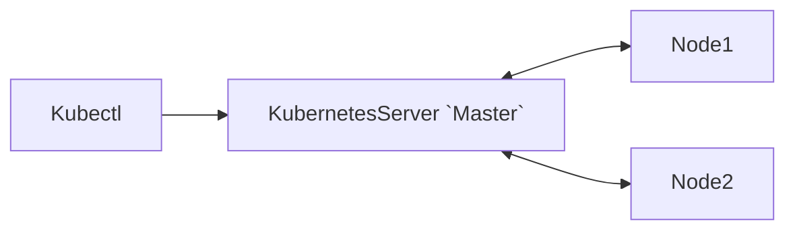

# `k8s`

遵循 `C/S` 架构，官方提供一个 `kubectl` 的 `CLI`，用于进行 `API` 管理



### 环境

- 安装
    - `Minikube`
    - `Kubectl`
    ```bash
    curl -LO https://github.com/kubernetes/minikube/releases/latest/download/minikube-linux-amd64
    sudo install minikube-linux-amd64 /usr/local/bin/minikube && rm minikube-linux-amd64
    curl -LO "https://dl.k8s.io/release/$(curl -L -s https://dl.k8s.io/release/stable.txt)/bin/linux/amd64/kubectl"
    ```
- 启动
    - `minikube start --image-mirror-country=cn`
- 删除
    - `minikube delete --purge`
    - `rm -rf ~/.minikube`

##### 常用命令

- `kubectl cluster-info` `kubectl get nodes`
  - 验证集群目前是否配置正确

### 基本概念

##### `Master`

- 接收
    - 外部请求和集群内的通知
- 发布
    - 对集群整体的调度和管理
- 存储

##### `API Server`

##### `Controller Manager`

运行许多控制器进程，调节集群状态

##### `Scheduler`

任务调度器

##### `Node`

物理机或者虚拟机

##### `Kubelet`

控制 `Node` 和 `Pod`

##### `Kube Proxy`

访问 `Pod`

##### `Deployment` `Pod`

`Deployment` 提供代理服務; `Pod` 最小的调度单元