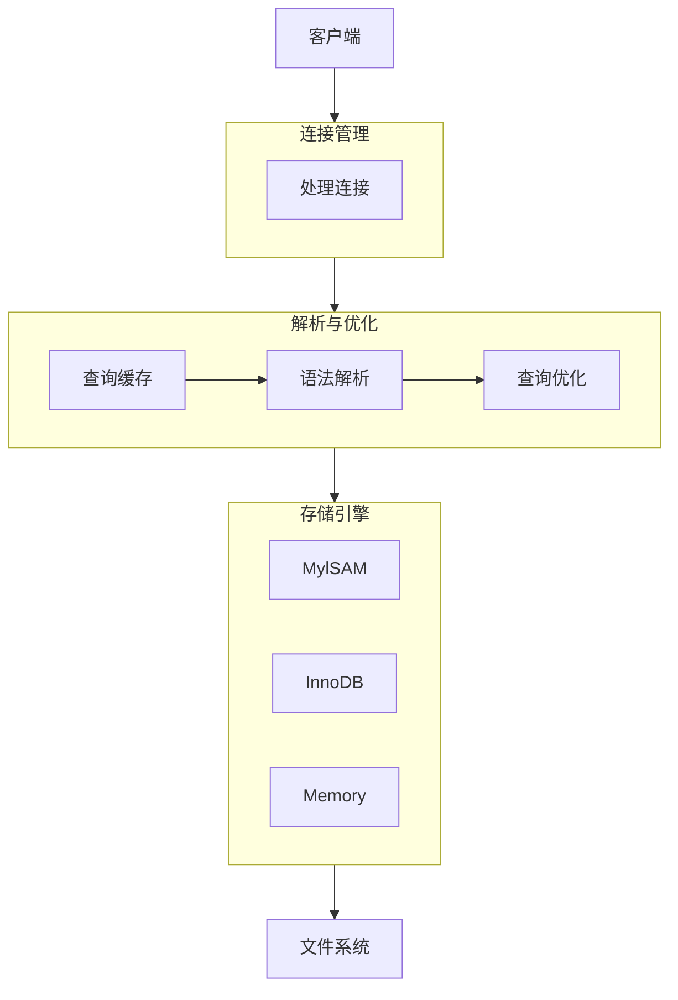

# Mysql

由两部分组成，客户端和服务端；服务器直接和我们存储数据打交道，可以有很多客户端连接到这个服务器，服务器响应请求从而维护数据
`Mysql` 服务器程序的进程被称作 `Mysql` 数据库实例，简称数据库实例
每个进程都有一个唯一的编号，称为进程 `ID`即 `PID`，操作系统会保证某一时刻一台机器上的进程号不重复。
每个进程都有一个名称，这个名称通常都是写程序的人自定义的，`Mysql` 服务器的默认名称为 `mysqld`，客户端默认为 `mysql`

`/usr/local/mysql/bin` 包含大量可执行文件

### 服务器和客户端

##### 启动 `Mysql` 服务器

- `Unix`
    - `mysqld`
        - `Mysql` 服务器程序，可以直接启动一个服务器程序，但是通常不使用
    - `mysqld_safe`
        - 一个启动脚本，间接调用 `mysqld`，同时启动一个监控程序，可以在服务器程序挂了之后帮助它重启，同时它会将服务器程序的日志重定向到文件中，方便后期调试
    - `mysql.server`
        - 一个启动脚本，会间接的调用 `mysqld_safe`
            - `mysql.server start` 启动服务器程序
            - `mysql.server stop` 关闭服务器程序
  > 这个文件实际上是一个链接文件，`../support-files/mysql.server`，不存在的话需要自己去创建
    - `mysqld_multi`
        - 可以启动多个服务器实例，可以单独对每个程序进行监控
- `Win`
    - `mysqld`
    - 服务
        - `"完整的可执行文件路径" --install [-manual] [服务名]`
            - `-manual` 表示是否随系统启动
            - `"C:\Program Files\MySQL\MySQL Server 5.7\bin\mysqld" --install`
            - `net start MySQL` `net stop MySQL`

##### 启动 `Mysql` 客户端

- `mysql`
    - `mysql -h主机名 -u用户名 -p密码`
    - 退出
        - `quit`
        - `exit`
        - `\q`

##### 客户端和服务器连接

本质上是进程之间通讯的过程

- `TCP/IP`
    - 真实环境中，数据库和客户端可能运行在不同主机中，它们之间必须通过网络来进行通讯。`Mysql` 采用 `TCP` 作为服务器和客户端网络通讯
- 命名管道和共享内存（`Windows` 上的通讯方式）
    - 使用命名管道
        - 启动服务器添加参数
            - `--enable-named-pipe`
        - 启动客户端添加命令
            - `--pipe` 或者 `--protocol=pipe`
    - 使用共享内存(同一台机器)
        - 启动服务器添加参数
            - `--shared-memory`
        - 启动客户端添加参数
            - `--protocol=memory`
- `Unix` 域套接字文件（同一台）
    - 启动客户端指定主机名 `localhost`，或指定 `--protocol=socket`
    - `mysql` 程序默认监听 `/tmp/mysql.sock`，客户端程序也默认连接到这个域套接字文件
    - 我们想改变这个默认路径，可以在启动服务器程序时指定 `socket` 参数
        - `mysqld --socket=/tmp/a.txt`
        - `mysql -hlocalhost -uroot --socket=/tmp/a.txt -p`

##### 服务器处理客户端请求

客户端进程向服务端进程发送一段文本（`MySQL` 语句），之后服务器进程再发送处理之后结果给客户端

- `MySQL server`
    - 连接管理
        - 每当有一个客户端进程连接到服务器进程，服务器进程会创建一个专门的线程来处理与这个客户端的交互，当该客户端退出会与服务器断开，服务器不会马上与客户端交互的线程销毁掉，会先缓存，分配下一个连接的客户端
        - 过多线程会影响系统性能
        - 客户端发起连接时需要携带主机信息、用户名等信息。如果客户端程序和服务器程序不在一起，可以采用 `ssl`
          （安全套接字），来保证数据传输安全
    - 解析与优化
        - 查询缓存
            - 服务器程序处理查询请求的过程中，会把刚才处理过的查询请求和结果缓存起来
            - 如果两个查询请求在任何字符上的不同，都会导致缓存无法命中
            - 如果查询包含某些系统函数，用户自定义变量或者函数，不会缓存
            - 缓存失效
                - 缓存系统会检测每一张表，只要该表结构或者数据被修改，那所有高速缓存查询都会变无效并从缓存删除
        - 语法解析
            - 如果缓存没有命中，接下来会进入正式查询阶段
                - 首先对文本分析看是否符合语法
                - 将需要查询的表和各种查询条件提取出来匹配数据结构
        - 查询优化
    - 提供统一的调用接口
- 存储引擎
    - 服务器把所有数据的存储和提取操作封装到了一个叫存储引擎的模块里
    - 常用(不重要)
        - `ARCHIVE`
            - 用于数据存档，不能修改
        - `BLACKHOLE`
            - 丢弃写操作，读操作会返回空内容
        - `CSV`
            - 在存储数据时，以逗号分隔各个数据项
        - `FEDERATED`
            - 访问远程表
        - `InnoDB`
            - 具备外键支持功能的事务存储引擎
        - `MEMORY`
            - 置于内存的表
        - `MyISAM`
            - 主要的非事务处理存储引擎
        - `MERGE`
            - 用来管理多个MyISAM表构成的表集合
        - `NDB`
            - `MySQL`集群专用存储引擎
    - 查看支持的引擎
        - `SHOW ENGINES;`
- 设置表的不同存储引擎
    - `CREATE TABLE 表名(建表语句;) ENGINE = 存储引擎名称;`



### 设置

- 命令行参数
    - `mysqld --skip_networking`
        - 禁止客户端使用网络进行通讯
        - `mysql -h127.0.0.1 -uroot -p` 此时无法连接
    - `mysqld --default-storage-engine=MyISAM`
        - 修改默认存储引擎，原本为 `InnoDB`
- 配置文件
    - 命令行的配置当次启动生效，需要持久保持需要修改配置文件
    - `Windows` 查询配置文件
        - `%WINDIR%\my.ini`， `%WINDIR%\my.cnf`
            - `Windows`目录
        - `C:`
        - `BASEDIR`
            - `mysql` 安装目录
        - `defaults-extra-file`
            - 命令行额外配置的
            - `mysqld --defaults-extra-file=C:\Users\xiaohaizi\my_extra_file.txt`
        - `%APPDATA%\MySQL\.mylogin.cnf`
            - 登录路径选项（仅限客户端）
            - 使用 `mysql_config_editor` 实用程序创建的加密文件，不是文本文件
    - `unix`
        - `/etc/my.cnf`
        - `/etc/mysql/my.cnf`
        - `SYSCONFDIR/my.cnf`
        - `$MYSQL_HOME/my.cnf`
            - 特定于服务器的选项（仅限服务器）
        - `defaults-extra-file`
        - `~/.my.cnf`
            - 用户特定选项
        - `~/.mylogin.cnf`
            - 用户特定的登录路径选项（仅限客户端）
    - 命令和组关系
        - `mysqld`
            - [mysqld]、[server]
        - `mysqld_safe`
            - [mysqld]、[server]、[mysqld_safe]
        - `mysql.server`
            - [mysqld]、[server]、[mysql.server]
          > 如果我们想指定 `mysql.server` 程序的启动参数，则必须将它们放在配置文件中；命令行参数只支持 `start` `stop`
        - `mysql`
            - [mysql]、[client]
        - `mysqladmin`
            - [mysqladmin]、[client]
        - `mysqldump`
            - [mysqldump]、[client]
    - 矛盾解决
        - 如果存在多个配置文件且有相同矛盾项目，以最后加载的文件为准，组也同理最后一个为准
        - 命令行和配置文件矛盾，命令行为准
        - `mysqld --defaults-file=/tmp/myconfig.txt`
            - 该参数使得不在默认路径下搜索

```ini
[server] # 用于服务器
option1            #这是option1，该选项不需要选项值
option2 = value2      #这是option2，该选项需要选项值

[mysqld]

[mysqld-5.7] # 只对 mysql 5.7 生效

[mysqld_safe]

[client] # 用户客户端

[mysql]

[mysqladmin]

```

##### 系统变量

服务器程序运行过程中会用到许多影响到程序的系统变量

- `max_connections`
    - 允许同时连入客户端的数量
- `default_storage_engine`
    - 表的默认存储引擎
- 查看系统变量
    - `SHOW VARIABLES [LIKE 匹配的模式];`
- 设置系统变量
    - 通过启动选项
        - `mysqld --default-storage-engine=MyISAM --max-connections=10`
    - 添加配置文件
- 服务器运行过程中设置
    - 大部分系统变量来说，它们的值可以在服务器运行过程中，动态的修改而无需停止服务器
- 设置不同作用范围
    - 全局
        - `GLOBAL`
        - 服务器启动时候初始化全局变量
    - 会话
        - `SESSION` (`LOCAL`)
        - 服务器为每一个连接的创建一组会话变量，复制相应全局变量的值
    - 命令
        - `SET [GLOBAL|SESSION] 系统变量名 = 值;`
        - `SET [@@(GLOBAL|SESSION).]var_name = XXX;`
        - 省略范围默认为 `SESSION`
    - `SHOW [GLOBAL|SESSION] VARIABLES [LIKE 匹配的模式];`

```ini
[server]
default-storage-engine = MyISAM
max-connections = 10
```

##### 状态变量

更好的反应服务器程序运行的状态，只能由服务器设置

- `Threads_connected`
    - 当前有多少客户端与服务器建立了连接
- `SHOW [GLOBAL|SESSION] STATUS [LIKE 匹配的模式];`

### 字符集和比较规则

字符集和比较规则有关

- `utf8mb3`（`utf8`）
    - 阉割 `utf8` 使用 1-3 个字节表示
- `utf8mb4`
    - 本来的， 1-4 个字节表示
- 查看字符集
    - `SHOW (CHARACTER SET|CHARSET) [LIKE 匹配的模式];`
- 查看比较规则
    - `SHOW COLLATION [LIKE 匹配的模式];`
    - `utf8mb4_general_ci`
    - `[字符集_语言_规则]`
- 应用
    - 有 4 个级别的字符集和比较规则
        - 服务器
            - `character_set_server`
            - `collation_server`
        - 数据库(`create` `alter`)
            - `[[DEFAULT] CHARACTER SET 字符集名称]`
            - `[[DEFAULT] COLLATE 比较规则名称]`
        - 表 (`create` `alter`)
        - 列
            - `列名 字符串类型 [CHARACTER SET 字符集名称] [COLLATE 比较规则名称],`
- 修改
    - 字符集和比较规则是互相有联系的，如果我们只修改了字符集，比较规则也会跟着变化，如果只修改了比较规则，字符集也会跟着变化
    - 只修改字符集，则比较规则将变为修改后的字符集默认的比较规则
    - 只修改比较规则，则字符集将变为修改后的比较规则对应的字符集
- 通信
    - 编码和解码使用的字符集不一样会导致乱码
    - `character_set_client`
        - 服务器解码字段
    - `character_set_connection`
        - 服务器处理请求时会把请求字符串从 `character_set_client` 转为 `character_set_connection`
    - `character_set_results`
        - 服务器向客户端发送处理完的数据

### `InnoDB`

将表中的数据存到磁盘，真正数据处理的过程发生在内存中。

- 页存储
    - 将数据分为若干页，以页作为磁盘和内存交换的基本单位，一般大小为 `16KB`
    - `File Header`
        - 页的通用信息
    - `Page Header`
        - 数据页的专用信息
        - 已经记录多少信息
        - 第一条记录地址
    - `Infimum + Supremum`
        - 虚拟行记录，最大最小记录
    - `User Records`
        - 数据存储
    - `Free Space`
    - `Page Directory`
        - 页中某些记录的相对位置，方便快速查找定位
    - `File Trailer`
        - 页尾部，校验页是否完整
- 行格式
    - 平时读写是以记录为单位插入数据，这些记录存放方式叫做 行格式 或者 记录格式
    - `Compact`
        - 记录额外信息
            - 变长字段长度列表
                - 应对可变长数据类型 (`VARCHAR`)
                - 真实数据
                - 占用字节数
                    - 各变长字段数据占用的字节数按照列的顺序逆序存放
            - NULL值列表
            - 记录头信息
        - 记录真实数据
    - `Redundant`
    - `Dynamic`
    - `Compressed`

```sql
 CREATE TABLE record_format_demo
 (
     c4 VARCHAR(10)
 ) ROW_FORMAT=COMPACT;
// 指定行格式
```

### `B+树索引`

各个数据页可以看作是一个双向链表
记录会按照主键值从小到大的顺序组成一个单向链表
每个数据页都会为存储在它里边儿的记录生成一个页目录，可以使用二分法快速定位

##### 没有索引查找

`SELECT [列名列表] FROM 表名 WHERE 列名 = xxx;`

- 在一个页里面查找
  - 以主键为搜索条件
    - 使用二分法在页目录里面快速定位到槽，遍历槽对应分组的记录
  - 其他列查找
    - 从最小记录遍历单链表中的数据
- 多页
  - 定位到记录在的页
  - 查找
- 索引
  - 创建一个类似主键的目录用来快速定位记录在哪些数据页
- `B+` 树
  - 本身其实就是一个索引
  - 用户记录的数据页
  - 目录项记录的数据页
  - 实际用户的记录但是存放在最底层节点
- 聚簇索引（只能用于主键）
  - 使用记录主键值的大小进行记录和页的排序 
  - `B+` 树的叶子节点存储的是完整的用户记录
- 二级索引
  - 叶子节点记录 主键 + 页号
  - 后面再通过主键查找
- 索引的影响
  - 时间空间开销增大

> 一个B+树索引的根节点自诞生之日起，便不会再移动