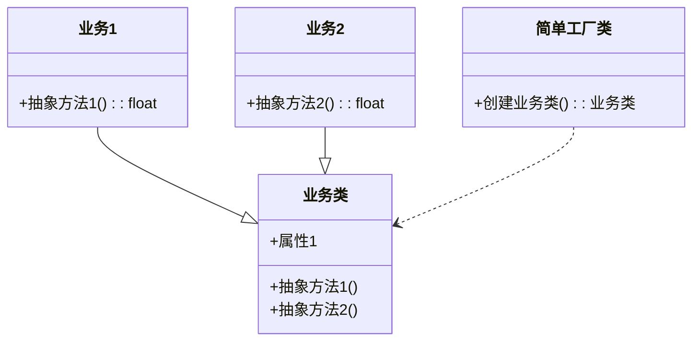
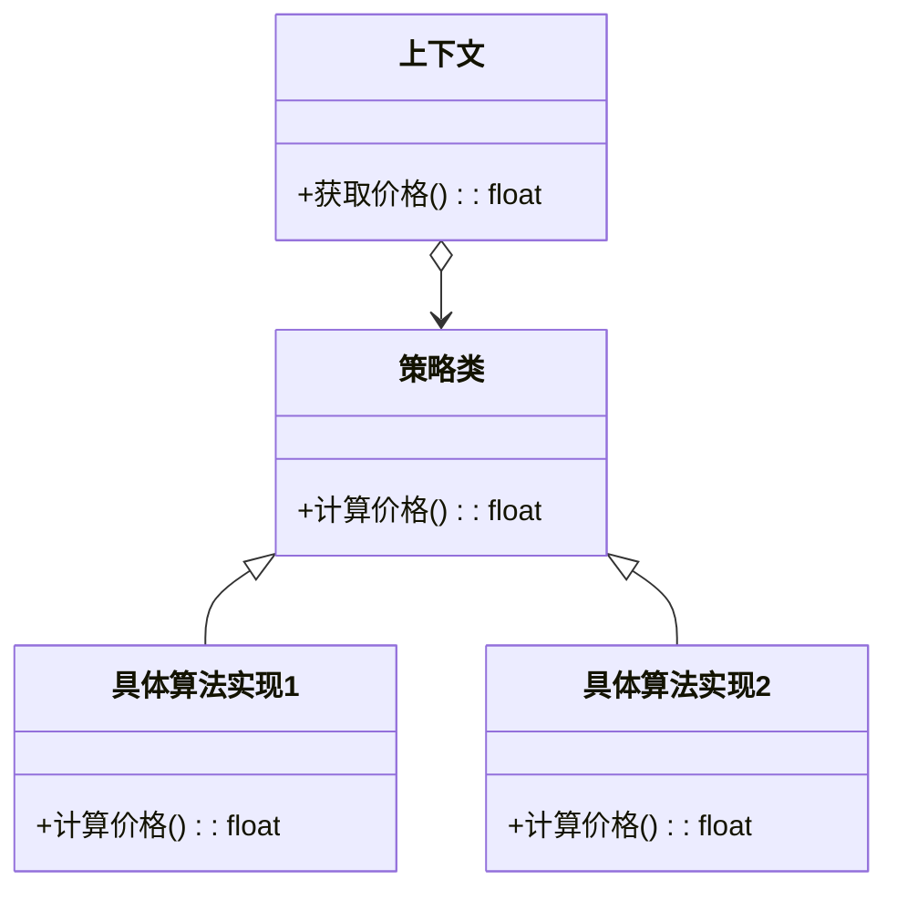
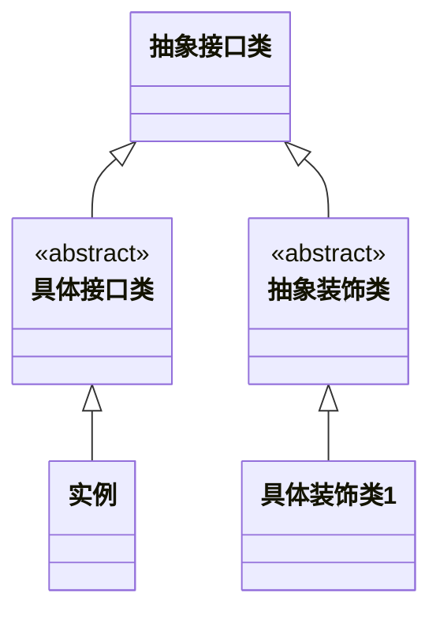
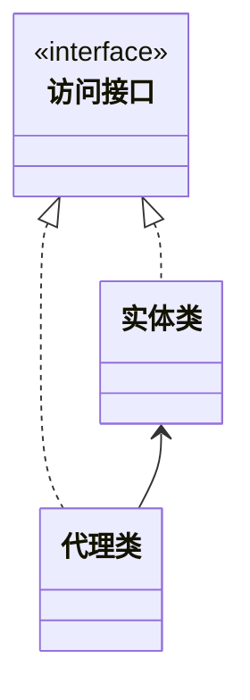

# 设计模式

软件开发过程中常见问题的解决方案

### 设计原则

- 单一职责
    - 一个类只负责一个功能领域
    - 一个类如果有其他职责，当其中一个职责发生改变时，可能影响其他职责
    - 如果因为多个原因去改变这个类，那么这个类就可以被拆分
- 开闭原则
    - 对扩展开放，对修改关闭
    - 要增加新功能，尽量扩展新代码而不是修改已有代码
- 迪米特法则
    - 尽可能少的与其他实体发生相互
    - 两个类彼此不必互相通信
- 依赖倒置原则
    - 依赖抽象，不依赖具体类
    - 针对接口编程，不要针对实现
- 里氏替换原则
    - 引用基类的地方必须能透明地使用其子类
    - 子类必须能给替换掉父类
- 接口隔离原则
    - 尽量缩小接口范围，让客户端不必实现不用的方法
- 合成/聚合复用原则
    - 尽量通过合成/聚合而不是继承达到复用目的

##### 简单工厂

使用一个单独的类来实现具体的实例化的过程，降低业务逻辑和界面逻辑的耦合

- 问题场景
    - 将类比作产品，使用者可以在不清楚类生产的具体过程的情况下，使用不同产品
- 组成
    - 抽象类
        - 定义所有公共接口
    - 具体业务类
    - 简单工厂类

##### 策略模式

定义一个算法家族，使得家族内部的不同算法都遵从算法家族的接口和方法规范，从而实现算法之间相互替换，且不影响到使用算法的客户

- 问题场景
    - 一个系统中有多个算法和类很相似，区分这些类和算法只是内部的行为
- 结构组成
    - 策略类
        - 定义所有支持算法的公共接口
        - 具体算法实现
        - 上下文
            - 维护策略类，维护对具体策略的引用
- 分析
    - 优点
        - 使用同样的接口调用所有算法，减少算法和算法类之间的耦合
        - 简化单元测试，每个算法可以单独使用各自的接口测试
        - 无需修改上下文
    - 缺点
        - 算法不能频繁变动
        - 客户端必须明确使用什么算法

##### 装饰模式

用来包装原来的类，从而动态的向一个对象添加一些额外的职责，同时不改变其原来的结构

- 场景
    - 在不生成很多子类的情况下扩展类
- 组成
    - 实体接口
        - 对象接口定义，为对象动态添加职责
    - 实体类
    - 装饰器抽象类
        - 继承接口实体接口，动态扩展其职责
    - 具体装饰器类
- 总结
    - 优点
        - 将类中的装饰功能从类中移除，简化类
        - 有效把类的核心职责和装饰功能区分开，去除重复的装饰逻辑
        - 装饰和被装饰类可以独立发展，不耦合
        - 无需新的子类实现对类功能的扩展
    - 缺点
        - 删除特定装饰器困难
        - 难实现行为不受到先后顺序影响的装饰

##### 代理模式

实现一个类代表另一个类的功能，为其他对象提供一种代理以控制这个对象的访问

- 场景
    - 不方便直接访问对象时，为不宜访问的对象提供一个访问
    - 分类
        - 本地执行远程服务
        - 延迟初始化
            - 客户端申请访问数据，先使用代理假装访问，后续在进行查询
        - 访问控制
        - 记录日志请求
        - 缓存请求结果
        - 智能指引
            - 快捷方式
- 组成
    - 访问接口
    - 实体类
    - 替代实体类的代理类
- 总结
    - 优点
        - 区分职责
        - 扩展用途
            - 远程代理可以隐藏一个对象在不同地址空间的事实
            - 虚拟代理可以存放实例化很长的对象
    - 缺点
        - 代码变复杂，需要创建许多子类
        - 服务器响应可能会延迟

##### 工厂方法模式

定义一个用于创建对象的结构，让子类决定实例化那些类。工厂类使类的实例化过程延迟到其子类
实现时，客户端需要决定实例化哪一个工厂来实现功能类，即判断调用哪个简单工厂

- 场景
    - 有明确的根据不同的条件创建实例
        - 无法预知对象确切类别及其依赖关系时，工厂方法能将创建产品的代码与实际使用产品的代码分离，在不影响其他代码的情况下扩展代码
- 组成
    - 访问接口
    - 实体类
    - 工厂类
- 总结
    - 优点
        - 避免创建者和具体产品之间紧密耦合
        - 扩展性高，增加一个新的产品，只需要扩展一个工厂类
    - 缺点
        - 可能需要引入大量类

##### 原型模式
使用原型实例指定创建对象的种类，并通过拷贝这些原型创建新的对象

- 